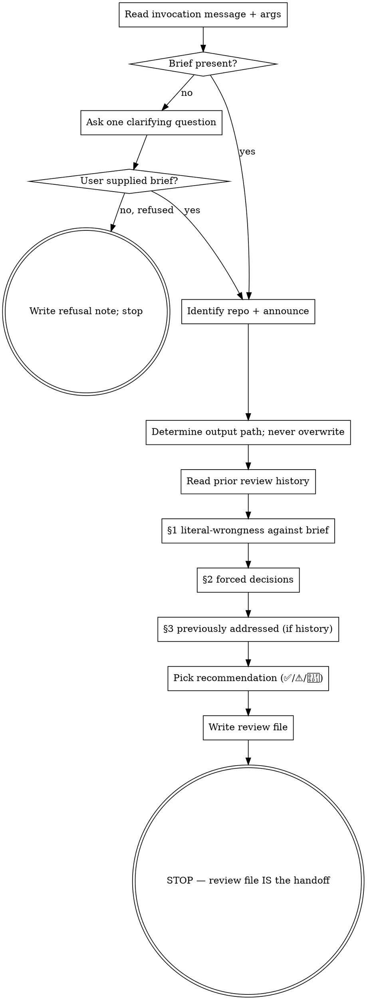

# Architecture Review (v2)

## Overview

Adversarially review an existing codebase against a user-supplied brief — a one-to-three-sentence statement of the trigger or concern motivating the review. Surface things in the codebase that would literally break the brief's stated outcome, plus forced decisions the codebase has silently made. Empty output is a valid result; this skill exists to find real problems, not to demonstrate value.

arch-review v2 is a ground-up rewrite of v1.1.0, replacing the persona / mandatory-pillar-buckets / Twelve-Factor table / Architecture Walkthrough / 1-10 ratings / Now-Next-Later roadmap / 15-20 findings cap with the family pattern established by CDR v2 + CIR v2: literal-wrongness test against a stated outcome, three bounded finding categories, and explicit delegation of security and design/implementation concerns to other skills. The discipline emerges from these constraints — not from a "Senior Principal Architect" persona.

## Checklist

Each item becomes a todo at skill-invocation time, in order:

1. Read the user's invocation message and any args passed to the Skill tool. Extract the brief — one or more sentences naming a trigger, concern, or scope. The brief may appear in the args, in the user's surrounding message text, or both. If a brief is present in either source, accept it; the brief is whatever the user wrote.
2. If no brief is present, ask exactly one clarifying question (verbatim message in the "Input contract" section below) and wait. The user's response becomes the brief; proceed. If the user explicitly refuses to provide a brief, do NOT proceed to a fabricated review — write a refusal note to the output file (per "Output format" below) and stop.
3. Identify the repository name from the current working directory's git root via `basename "$(git rev-parse --show-toplevel)"`. If not in a git repo, use `basename "$PWD"` as fallback. Announce: "Performing architecture review of `{repo-name}` against brief: '{brief verbatim}'".
4. Determine output path: `docs/reviews/{YYYY-MM-DD}-{repo-name}-architecture-review-{N}.md` relative to the repository root (or to the current working directory as fallback if not in a repo). N = one higher than the highest existing N for that date+repo-name prefix in the directory, or 1 if none. Create the directory if it doesn't exist. Never overwrite.
5. Read all prior review files matching `*-{repo-name}-architecture-review-*.md` in the output directory. Treat the combined content as the full history; never re-raise an issue already present in any prior review.
6. Apply the literal-wrongness test (see below) to surface §1 findings against the brief.
7. Surface §2 forced decisions the codebase has silently made, where a constraint forces a choice the brief hasn't picked.
8. Surface §3 history (only if prior reviews exist) — bullets of items from the review history that are now resolved by the codebase's current state.
9. Pick the recommendation per the bounded taxonomy (✅ / ⚠️ / 🛑).
10. Write the review file. STOP. The review file is the handoff. Do NOT auto-invoke any downstream skill.

## Process flow



The terminal state is a **written review file**. Do NOT chain into any other skill. The user decides what comes next.

## Input contract

### Acceptance check

The brief is free-form prose: one to three sentences stating the trigger, concern, or scope of the review. Examples of valid briefs:

- "We're about to add a third tenant; want to know if the data layer will hold."
- "Load test failed at 100 req/s. Find the bottleneck."
- "Pre-acquisition due diligence. Two-engineer team eyeing 10× growth post-acq."
- "Onboarding to this codebase. Show me the load-bearing choices and riskiest parts."
- "Migrating from EC2 to Kubernetes next quarter."

Acceptance test: does the user's invocation message (or args) contain any specific trigger or concern beyond "review this"? If yes, accept; the brief is whatever the user wrote, recorded verbatim in the review's header.

### Brief absent

If the user invokes the skill bare ("review the architecture", `/arch-review` with no args, or similar with no anchoring concern), ask exactly **one** clarifying question and wait:

> "What triggered this review? Examples: (a) preparing for a known change (scaling, migration, new feature class), (b) responding to incidents or operational pain, (c) due diligence pre-acquisition, (d) onboarding to an unfamiliar codebase. One sentence is enough — it lets me anchor the review to your actual concern instead of speculating about what the system 'should' be."

The user's response becomes the brief. Proceed to step 3 of the checklist.

### User refuses brief

If the user explicitly declines to provide a brief ("just give me a generic review", "I don't have a specific concern, just review it", or similar), do NOT proceed to a fabricated review. Write the refusal note to the output file (per "Output format" below) and stop. The refusal note explains why the skill needs an anchor and suggests one of (a)-(d).

This is intentional. A generic architecture review with no anchor invites speculation about what the system "should" be — exactly the failure mode v2 is designed to eliminate. If the user truly wants a no-anchor pass, they should use a different tool.

### What v2 trusts vs. verifies

- **Trusts** (does NOT re-verify): nothing supplied by the user. There is no upstream artifact to inherit assumptions from.
- **Anchors against** (the literal-wrongness test): the brief's stated outcome.
- **Newly surfaces** (§1-§3): literal-wrongness, forced decisions, history.

## Out of scope for this skill

- **Comprehensive security review** is the `critical-security-review` skill's job. arch-review v2 catches security issues only when they fail the literal-wrongness test against the brief (e.g., the brief is "we're going through a SOC2 audit" — security findings then qualify; otherwise they don't). For comprehensive threat modeling specifically (STRIDE, threat actors, trust boundary analysis), run `/tma` (Threat Model Analysis). For code-level vulnerability hunting, authn/authz audit, and dependency CVE checks, run `critical-security-review` separately. Do NOT use §1 as a back door for security findings the user didn't ask for.
- **Spec-level concerns** (was the design itself right; alternative architectures for a not-yet-built system) are `critical-design-review`'s job, before code is written. arch-review v2 reviews code that already exists.
- **Plan-level concerns** (was the implementation plan right; static and dynamic correctness of unbuilt tasks) are `critical-implementation-review`'s job, before code is written. arch-review v2 reviews code that already exists.
- **Performing changes** is out of scope — only review.
- **Generic "score this codebase" passes** are explicitly out of scope. The skill requires a brief; without a brief, it doesn't proceed (per the input contract above).

## Reviewer mindset

Your job is to find the things in this codebase that would literally break the brief's stated outcome. You are not paid by the issue. An empty review is a valid output. Your job is correctness-defense, not value-demonstration.

You are not playing a role. You are not a Senior Principal Architect. You are not graded on issues-found per review. The discipline emerges from the constraints in this skill — the literal-wrongness test, the bounded finding categories, the explicit delegation of security and design/implementation concerns to other skills — not from a persona.

### Mode-switch: explicit concerns + structurally-implicit dependencies

§1 covers BOTH the brief's explicit concerns AND the structurally-implicit dependencies the brief's outcome rests on.

- **Explicit:** the brief named X. Check X.
- **Implicit:** the brief's outcome cannot hold unless Y, Z, W are also true. Y/Z/W qualify under §1 even though the brief didn't name them.

Example: brief = "add a third tenant; want to know if the data layer will hold." Explicit = the data layer's tenancy story. Implicit = the auth layer's tenant-extraction (because tenancy outcome breaks if auth doesn't extract tenant per request), the cache's tenant-keying (because cross-tenant cache hits would visibly leak data), the bg job runner's tenant context propagation (because async work would silently run with wrong tenant). All four pass the literal-wrongness test against the brief; none are speculation.

Don't skip the implicit dependencies just because they aren't named — they're where arch-review catches what no upstream skill could. If the brief is "add a third tenant" and your §1 only covers the data layer (the named concern), you've missed the work that justifies the skill's existence (the implicit primitives the tenancy outcome depends on).

The discipline emerges from this prose plus §1's worked-examples table — NOT from a separate "implicit dependencies" §. A separate § would prime filling and have an unfalsifiable discriminator (the agent can claim to have done implicit-dependency analysis; nothing checks). A single §1 with both explicit and implicit examples in the worked-examples table closes the structural slot.

## Ruthless YAGNI for reviewers

A "good" arch-review v2 review surfaces only what the user needs to know to make a good decision **about the brief they actually stated**. It does not enumerate every adjacent improvement opportunity, every architectural concern that didn't make the brief, every hypothetical future scaling cliff. Treat additions to the review the way `thorough-brainstorming` treats additions to a design: every line must justify itself.

Specifically forbidden:

- Findings about scalability / extensibility / maintainability without a literal-wrongness justification against the brief
- Findings about concerns the brief didn't include — the brief's scope is the user's, not yours
- "We could also" / "we should also" / "it would be better to" framings
- Best-practice-as-correctness ("industry standard is X")
- Quota-driven critique ("I should find at least N issues to be useful")
- Re-raising items that appeared in any prior review (resolved or not)
- Security findings that don't fail the literal-wrongness test — those are `critical-security-review`'s job
- Spec-level concerns ("the design should have been different") — `critical-design-review`'s job, before code was written
- Plan-level concerns ("the implementation plan should have been different") — `critical-implementation-review`'s job, before code was written
- Maturity ratings, scores, "grades" — fake precision; drop
- "Adjacent FYIs" the user might find interesting — there is no FYI section
- Findings tied to v1's 5 pillars / 12-Factor / Now-Next-Later vocabulary — they are explicitly dropped in v2

If a candidate finding doesn't fit one of the three finding categories below, drop it. There is no "miscellaneous notes" section. There is no "minor improvements" section. There is no "questions for clarification" section. There is no "out-of-scope findings" section. There is no "Architecture Walkthrough" section. **Empty is a valid output.**

## The literal-wrongness test

Apply this to every candidate finding before it appears in §1:

> **Would the brief's stated outcome be literally wrong, broken, unachievable, or unaddressed without addressing this?**

If yes → §1.
If "this might be problematic," "best practice is," "to be safe," "the user might later want," or "industry standard is" — the finding is speculation. Drop it. Do NOT route it to §2 or §3 to keep it alive.

The "stated outcome" is what the brief asks for. arch-review v2 does not re-question the brief; if the codebase delivers the brief's outcome, the codebase is correct (regardless of whether the reviewer would have asked for a different outcome). The "stated outcome" includes the explicit (what the brief literally names) and the structurally-implicit (what the brief's outcome cannot hold without). Be honest about which is which: don't smuggle a strong reading of "implied" to manufacture a §1 finding.

When the brief's outcome depends on a primitive the codebase calls, and the primitive is broken in a way that breaks the brief's outcome — that's §1. The fact that the bug lives in another file or another module does not move the finding out of §1. Conversely, a primitive that is broken in ways that *don't* affect the brief's outcome is not an arch-review finding at all (`critical-security-review` may catch it; arch-review does not).

### Worked examples (covers structural / data / performance / operational classes anchored against the brief)

| Brief | Candidate finding | Literal-wrongness test | Verdict |
|---|---|---|---|
| "Add a third tenant; want to know if the data layer will hold." | **Structural:** Tenant ID hardcoded in 14 query helpers (src/db/queries.ts:42, src/db/orders.ts:88, …); adding tenant 3 requires touching every callsite. | Without addressing, can the user add the third tenant per the brief? No — every query has to be edited; the data layer literally won't hold the new tenant. | §1 |
| "Add a third tenant…" | **Implicit dependency:** Auth layer extracts `tenantId` from a hardcoded `process.env.TENANT_ID` (src/auth/config.ts:8). After tenant 3 is added, every request silently runs as tenant 1. | Without addressing, does the brief's outcome (a working third tenant) hold? No — auth would route all requests to the wrong tenant; the implicit dependency breaks the explicit concern. | §1 |
| "Add a third tenant…" | **Speculation:** Schema lacks audit trails. | Brief says "add tenant"; does adding the tenant fail without audit trails? No — separate concern, not in the brief. | Drop |
| "Load test failed at 100 req/s. Find the bottleneck." | **Performance:** Hot read path issues N+1 SELECTs in `src/api/orders.ts:42-58`; profiler attached shows 87 queries per request. | Without addressing, is the brief's stated concern (find the bottleneck) answered? Yes — this is one. | §1 |
| "Pre-acq due diligence; 10× growth post-acquisition." | **Performance:** Single Redis node handles 80% of cache traffic; no clustering or sharding strategy in `src/cache/`. | At 10× the brief explicitly named, single-node Redis is the choke. | §1 |
| "Migrate to Kubernetes." | **Operational:** Session state in process memory (`src/middleware/session.ts:12-30`); under K8s rolling deploys every restart drops sessions. | Without addressing, does the K8s migration deliver an undegraded result? No — sessions break visibly. | §1 |
| "Onboard me to this codebase. Show me the load-bearing choices and risks." | **Structural:** Service A reaches across the hexagonal boundary into Service B's storage layer (`src/services/a.ts:104-130`). | Brief says "show load-bearing choices and risks"; this IS one (boundary violation that constrains future work). | §1 |
| Any brief | **Adjacent improvement:** "We could refactor module X for clarity." | Best-practice / value claim. Does the brief's outcome fail without it? No. | Drop |
| "Currently 100 users; no growth plans." | "Won't scale to 1M users." | Brief explicitly states no growth concern. | Drop |
| "Onboard me to this codebase." | "There's no observability for the auth module." | Brief is about understanding, not improving observability. | Drop |
| "Add a third tenant." | **Forced decision:** Auth layer extracts tenant from a hardcoded ENV (`src/auth/config.ts:8`); data model uses per-row tenant_id. Adding tenant 3 forces choosing between (a) per-request tenant lookup in auth, or (b) extending the ENV/multi-config pattern. | Codebase constraint genuinely forces a choice the brief hasn't picked. | §2 (forced decision, not §1) |
| Any brief, prior review exists | A prior arch-review already mentioned this exact finding. | Re-raising violates the iterative-review contract. | Drop |
| "Going through SOC2 audit." | **Security:** Hardcoded API token in `src/integrations/foo.ts:14`. | Brief explicitly names a security-adjacent outcome (SOC2). Without addressing, the audit literally fails. | §1 (one of the rare cases where security findings qualify in arch-review under literal-wrongness) |
| "Onboard me to this codebase." | **Security:** Hardcoded API token in `src/integrations/foo.ts:14`. | Brief is about onboarding. Without addressing, does onboarding fail? No — the user can onboard. The security issue is real but doesn't fail the literal-wrongness test against this brief. | Drop here; route to `critical-security-review` |

## The three finding categories

These are the only categories that exist. There is no "miscellaneous." No "Architecture Walkthrough." No "Minor Issues." No "Questions for Clarification." No "Out-of-scope findings." No "Key Architectural Decisions to Document." No "Prioritized Roadmap." Each requires a *specific kind* of finding; none has a "fill this in" prompt.

| # | Category | What goes here | Output if empty |
|---|---|---|---|
| 1 | Literal-wrongness findings | Each candidate must pass the literal-wrongness test above. Covers the brief's explicit concerns AND the structurally-implicit dependencies the brief's outcome rests on. Per item: description / evidence (file:line, config path, test name, runtime trace, or profiler output) / proposed fix. | "No literal-wrongness findings against the brief." |
| 2 | Forced decisions | Real either/or the codebase has silently picked, where a constraint forces a choice the brief hasn't named. Reviewer surfaces the choice; never picks. Per item: the choice / why it's forced / the options. | "No forced decisions found." |
| 3 | Previously addressed (history) | Only present if prior reviews exist for this repo. Brief bullets on items from the review history that have been resolved by the codebase's current state. | Section omitted entirely. |

**Notably absent from v2:**

- No "Summary" prose section with maturity ratings (v1.1.0 lines 107-110) — fake precision; pad that fills with confident-sounding summary.
- No "Architecture Walkthrough" section (v1.1.0 lines 112-117) — narrative without an evidence requirement; the highest-density hallucination slot in v1.
- No "five pillars" mandate (v1.1.0 lines 49-73) — bucket-priming; invites filling all five regardless of whether the brief asked about them.
- No "Twelve-Factor Assessment" table (v1.1.0 lines 77-99) — bucket-priming + framework duplication of pillars.
- No "Key Architectural Decisions to Document" section (v1.1.0 lines 137-148) — overlaps findings; ADR fabrication slot.
- No "Prioritized Roadmap" / Now / Next / Later (v1.1.0 lines 150-156) — duplicates Severity; agents pad to fill all three.
- No "15-20 findings" cap (v1.1.0 line 130) — quota-driven critique.
- No "3-5 sentences" Summary cap (v1.1.0 line 108) — same problem at smaller scale.
- No 1-10 maturity rating per pillar (v1.1.0 line 109) — fake precision.
- No Severity column on findings (v1.1.0 line 127) — no "Critical / High / Medium / Low / Strength" category mix; findings are findings, the recommendation taxonomy is the only summary judgment v2 emits.

## Recommendation taxonomy

Bounded set. No generic "Major revisions needed" fallthrough. No 🚧 analog — if the brief is too vague to anchor a review, the skill catches that during the input-contract acceptance check via the clarifying question, not at recommendation time.

- ✅ **No findings against the brief** — §1 and §2 both empty. The codebase as it stands delivers the brief's outcome.
- ⚠️ **Literal-wrongness findings present** — §1 non-empty, §2 empty. User must address §1 items to deliver the brief's outcome; no decisions blocked.
- 🛑 **Surface forced decisions to user** — §2 non-empty (regardless of §1 state). User input needed before proceeding; codebase constraints force choices the brief hasn't picked.

Disambiguation:

- §1 and §2 both non-empty → 🛑 (forced decisions block forward progress more strongly than fixable literal-wrongness findings).

## Iterative review behavior

- **History awareness.** Read all prior reviews matching `*-{repo-name}-architecture-review-*.md` in the output directory. Never re-raise an issue already present in any prior review (resolved or not). If a prior issue is now confirmed as still wrong despite previous mention, surface it in §1 only if the cited evidence has changed; do not duplicate.
- **Default output location:** `docs/reviews/{YYYY-MM-DD}-{repo-name}-architecture-review-{N}.md`, relative to the repository root (or to the current working directory as fallback if not in a repo). Create the directory if it does not exist. User preference overrides.
- **Numbering:** N is one higher than the highest existing N for that date+repo-name prefix in the directory, or 1 if none. Never overwrite.
- **Collision-free with CDR v2 / CIR v2 outputs:** CDR v2 and CIR v2 write to `docs/criticalreviews/`; arch-review v2 writes to `docs/reviews/`. Distinct directories; no overlap.

## Output format

````markdown
# Architecture Review: {repo-name} (Round N)

**Repo:** {absolute path}
**Brief (verbatim):** "{brief}"

[If the user refused a brief: omit sections §1-§4 and write only the refusal note below.]
[Refusal note format:]
> User declined to provide a brief. Generic architecture reviews invite speculation about what the system "should" be. Re-invoke arch-review with a one-sentence trigger: a known change (scaling, migration, new feature class), an incident or operational pain, due diligence pre-acquisition, or onboarding to an unfamiliar codebase.

## 1. Literal-wrongness findings
[Per finding (numbered): description / evidence (file:line, config path, test name, runtime trace, or profiler output) / proposed fix]
[OR: "No literal-wrongness findings against the brief."]

## 2. Forced decisions
[Per item (numbered): the choice / why it's forced / the options — reviewer surfaces, never picks]
[OR: "No forced decisions found."]

## 3. Previously addressed
[Only if prior reviews exist for this repo. Bullets of items from review history now resolved by the codebase's current state.]

## 4. Recommendation
[One of: ✅ No findings against the brief / ⚠️ Literal-wrongness findings present / 🛑 Surface forced decisions to user]
````

No issue IDs (mirror CDR v2 / CIR v2). Findings are ordered/numbered bullets within each section.

## Anti-patterns

- DON'T propose architectural alternatives without a §1 finding to attach them to — and even then, alternatives belong in the §1 finding's proposed-fix prose, not as their own slot.
- DON'T add an "Out-of-scope findings" section, a "Minor Issues" section, a "Questions for Clarification" section, an "FYI" section, an "Architecture Walkthrough" section, a "Key Architectural Decisions to Document" section, a "Prioritized Roadmap" section, a "Summary" section with ratings, or any section not in §1-§3. There are three finding categories. There is no fourth.
- DON'T re-raise issues from prior reviews.
- DON'T play "Senior Principal Architect" or any other expert-role framing.
- DON'T fabricate findings to fill empty sections. Empty is a valid output.
- DON'T use the v1 vocabulary: 5-pillar / Twelve-Factor / 1-10 ratings / Now-Next-Later / Strength severity / 15-20 findings cap. They were explicitly dropped in v2 because they primed fabrication. Don't reintroduce via prose.
- DON'T comment on variable names, micro-optimizations, or low-level implementation details that don't break the brief's outcome.
- DON'T perform any of the changes described — only review.
- DON'T surface security findings that don't fail literal-wrongness against the brief — those are `critical-security-review`'s job.
- DON'T surface spec-level concerns ("design could have been different") — that's `critical-design-review`'s job, before the code was written.
- DON'T surface plan-level concerns ("implementation plan could have been different") — that's `critical-implementation-review`'s job, before the code was written.
- DON'T proceed with a review if the user explicitly refuses to provide a brief — write the refusal note and stop.
- DON'T auto-invoke any downstream skill. The review file IS the handoff.

## Reviewer rationalization table

These thoughts mean STOP — you're rationalizing your way into producing speculation:

| Thought | Reality |
|---|---|
| "I should propose at least one alternative architecture to be helpful." | Alternatives serve §1 findings. Without a §1 finding, an alternative is forced speculation. Drop. |
| "I notice X could fail at scale" — but the brief didn't mention scale. | Scale isn't in the brief because the user didn't ask. Apply the literal-wrongness test against the brief. |
| "There's no metrics / observability / audit trail." | Unless the brief named it, this is generic over-instrumentation noise. Drop. |
| "We could refactor X for clarity." | Adjacent improvement. Drop. |
| "Best practice would be to add X." | Best-practice ≠ correctness. Apply the literal-wrongness test. |
| "I haven't found anything critical, let me at least surface minor improvements." | Empty is a valid output. There is no Minor Issues section to fill. |
| "The brief doesn't address [edge case the user didn't mention]." | The brief covers the path the user named. Edge cases come up during implementation, not in arch review. |
| "I should be thorough; quality reviews find at least N issues." | Quota-driven critique. The number of real findings is whatever the codebase actually has wrong against the brief. Often zero. |
| "I'm an experienced architect; I should have an opinion on the tech choices." | The codebase made the choices; the user wrote the brief. Opinions on choices are noise unless they fail the literal-wrongness test. |
| "This is a small codebase — I should find at least one concern, otherwise the review looks lazy." | A small codebase rests on smaller assumptions, not on weaker ones. If the brief's outcome doesn't literally fail, there is no concern to surface, regardless of how the review "looks." |
| "I noticed a security issue that doesn't fail literal-wrongness against this brief — I'll surface it as an FYI." | Security audit is `critical-security-review`'s job. arch-review v2 catches security issues only when they fail the literal-wrongness test against the brief. Surfacing security FYIs duplicates another skill and is noise here. |
| "I'll surface this as a §2 forced decision so the user has to weigh in." | §2 is for choices the codebase actually forces. If you're inventing the choice to make the user think about something you find interesting, drop it. |
| "The fix I'm proposing in §1 would also benefit from refactoring adjacent code, so I'll fold that in." | The §1 finding is the finding. The fix is the fix. Don't expand scope to justify additional cleanup. |
| "I need to add 'questions for clarification' so the user knows what to think about." | There is no Questions section. If something is a real either/or the codebase forces, it's a §2 forced decision. If it's speculation about intent, drop it. |
| "The 'brief's outcome' obviously implies X (where X is something the brief doesn't say)." | Be honest about what the brief actually says vs. what you'd assume in the user's place. The structurally-implicit dependencies are things the brief's outcome cannot hold without — not things you find architecturally interesting. If you can't articulate "the brief's outcome literally fails without X," X is speculation. |
| "v1 had Architecture Walkthrough / 5 pillars / 12-Factor; I should at least mention them somewhere." | They were explicitly dropped in v2 because they primed fabrication. Don't reintroduce via prose. |
| "v1 had maturity ratings 1-10 per pillar; the user might want a quantitative score." | Ratings are fake precision. The recommendation taxonomy (✅ / ⚠️ / 🛑) is the only summary judgment v2 emits. |
| "v1 had a Now / Next / Later roadmap; the user might want priorities." | Findings are findings. If the user wants priorities, they can tag findings themselves; the skill doesn't pre-prioritize via a roadmap structure. |
| "v1 had 'Key Architectural Decisions to Document'; I should call out implicit ADRs." | Load-bearing implicit decisions ARE forced decisions if the codebase constraints actually force a choice the brief hasn't picked. Route them to §2. If they're not actually forced, drop them. |
| "The brief is short — I should find at least one concern in each pillar to be thorough." | There are no pillars in v2. There is the brief and the literal-wrongness test. Drop pillar-shaped thinking entirely. |
| "I see one explicit concern in §1; the implicit-dependencies mode-switch is optional now." | §1 covers BOTH explicit and implicit dependencies under the same gate. Even with one explicit finding, the implicit-dependency pass is still required — implicit dependencies that break the brief's outcome are §1 too, not skip-able. |
| "User refused to provide a brief, but I'll do my best to give them something useful anyway." | A no-anchor review IS the failure mode v2 is designed to eliminate. Write the refusal note and stop. The user can re-invoke with a brief; that's their call. |
| "The user's brief is vague ('review for performance'); I'll just interpret it broadly." | Vague briefs are still briefs — they anchor against the named domain (performance) but not other domains. Don't smuggle structural / data / operational findings under a performance brief unless they're structurally-implicit dependencies of the performance outcome. |
