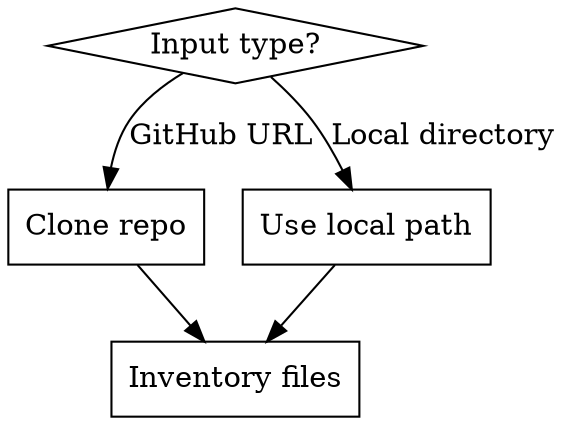

# COBOL System X-Ray

## Overview

Reverse-engineer the DNA of a legacy COBOL system — structure, logic flows, data dependencies, risks, and modernization readiness — from its source artifacts. Every claim must cite specific file and line evidence.

## When to Use

- User provides a COBOL codebase (local directory or GitHub repo) for analysis
- Migration feasibility assessment needed
- Stabilization or refactoring of a legacy mainframe system
- System archaeology / discovery audit
- Risk assessment before touching a decades-old production system

**When NOT to use:** For active COBOL development, writing new COBOL code, or JCL debugging.

## Input

The user provides ONE of:
- **Local directory path** containing COBOL source artifacts
- **GitHub repo URL** to clone and analyze

## Execution Steps

### Step 1: Acquire the Codebase



- If GitHub URL: clone to a temp directory (e.g., `/tmp/{repo-name}-xray`). Record this path so it can be cleaned up after the analysis is complete.
- If local path: verify it exists
- Glob for all relevant file types: `*.cbl`, `*.cob`, `*.cpy`, `*.jcl`, `*.bms`, `*.prc`, `*.sql`, `*.ddl`

### Step 2: Context Intake

Before analysis, confirm what was received. List artifact types found and flag missing types:

| Artifact Type | Extensions | Found? |
|---------------|-----------|--------|
| COBOL programs | `.cbl`, `.cob` | |
| Copybooks | `.cpy`, COPY members | |
| JCL members | `.jcl` | |
| BMS maps | `.bms` | |
| PROC / cataloged procedures | `.prc` | |
| Control cards / parameter files | | |
| DB2 DDL / DBRM binds | `.sql`, `.ddl` | |
| CICS CSD extracts | | |

### Step 3: Run the Analysis

Analyze ALL five dimensions below **in order** — each builds on the prior. Use subagents to parallelize where dimensions are independent (e.g., Dimensions 3-5 can run in parallel after 1-2 complete).

## Analysis Dimensions

### Dimension 1: Structural Inventory & Completeness

**Purpose:** Establish what we have before reasoning over it.

- **Component Manifest:** List all components grouped by type with counts, LOC per file, total LOC.

  | Type | Member Name | LOC | Notable Flags |
  |------|------------|-----|---------------|
  | COBOL Program | ACCTUPD.cbl | 3,400 | CICS, DB2 |
  | Copybook | ACCT-REC.cpy | 85 | Used by 4 programs |
  | JCL | NIGHTLY.jcl | 120 | 6 steps, SORT |

- **Missing Links:** Every external reference pointing to an absent artifact:

  | Source File:Line | Reference Type | Target | Impact |
  |-----------------|---------------|--------|--------|
  | ACCTUPD.cbl:210 | CALL | 'DATEUTIL' | Date processing unavailable for review |
  | NIGHTLY.jcl:45 | DD DSN | PROD.ACCT.MASTER | Dataset structure unknown |

- **Dead / Orphan Code:** Unreachable paragraphs (via `PERFORM` / `GO TO` analysis), unused copybooks, JCL members with no scheduler reference. Distinguish "confirmed dead" vs "possibly dead — no caller found in provided files."

### Dimension 2: Architectural & Logic Flow

**Purpose:** Understand how the system moves.

- **Call Graph:** Hierarchical invocation map:
  - Static calls (`CALL 'literal'`) vs. dynamic calls (`CALL ws-variable`)
  - CICS invocations (`LINK`, `XCTL`, `START`, `RETURN TRANSID`)
  - IMS calls (`CBLTDLI`)
  - JCL EXEC PGM chains
  - Mark entry points: CICS transaction IDs, batch JCL drivers, IMS PSBs
  - Format as indented tree or Mermaid diagram

- **God Programs / Hotspots:** Programs exceeding any threshold:
  - \> 2,000 LOC
  - \> 5 levels of nested `IF` / `EVALUATE`
  - \> 3 `GO TO` targets (spaghetti indicator)
  - Central coupling (called by or calling > 5 other programs)
  - High CRUD surface (touches > 3 files/tables)

- **Sequence Diagrams:** For each major business process or transaction flow identified in the codebase, generate a Mermaid sequence diagram showing the temporal interaction between components:
  - Trace the flow from entry point (CICS transaction, JCL step, IMS trigger) through all program calls, data access, and returns
  - Show participants: programs, CICS regions, DB2, VSAM files, MQ queues, external systems
  - Include message labels: `CALL`, `LINK`, `XCTL`, `EXEC SQL`, `READ`, `WRITE`, `MQPUT`, `MQGET`, etc.
  - Show conditional branches with `alt` / `else` blocks where logic forks (e.g., error paths, business rules)
  - Show loops with `loop` blocks for iterative processing (e.g., cursor fetches, file read loops)
  - Annotate with `note` blocks for critical business logic, transformations, or hardcoded values at key steps
  - Prioritize: generate diagrams for the **top 3-5 most critical flows** (highest-traffic transactions, core batch jobs, or flows touching the most hub resources from the CRUD matrix)
  - Each diagram must cite the source evidence: list the `FILE:LINE` references that informed the flow

  Example format:
  ```mermaid
  sequenceDiagram
      participant JCL as NIGHTLY.jcl
      participant PGM as ACCTUPD
      participant CPY as ACCT-REC
      participant VSAM as ACCT-MASTER
      participant DB2 as ACCT_TABLE

      JCL->>PGM: EXEC PGM=ACCTUPD
      PGM->>CPY: COPY ACCT-REC
      loop For each input record
          PGM->>VSAM: READ ACCT-MASTER
          alt Record found
              PGM->>VSAM: REWRITE ACCT-MASTER
              PGM->>DB2: EXEC SQL UPDATE ACCT_TABLE
          else Not found
              PGM->>DB2: EXEC SQL INSERT ACCT_TABLE
          end
      end
      PGM->>JCL: GOBACK (RC=0)
  ```

- **Online vs. Batch Split:** Estimate % of programs and LOC in each category. Flag dual-mode programs.

### Dimension 3: Data Dependencies & Vital Signs

**Purpose:** Map the data landscape — the hardest part of any migration.

- **CRUD Matrix:**

  | Program | Resource | Type | C | R | U | D | Access Method |
  |---------|----------|------|---|---|---|---|---------------|
  | ACCTUPD | ACCT-MASTER | VSAM KSDS | | X | X | | READ/REWRITE |
  | ACCTUPD | ACCT_TABLE | DB2 | | X | X | X | EXEC SQL |

  Highlight **hub resources** touched by 3+ programs.

- **Hardcoded Risks:** Literals threatening portability/flexibility:
  - Dates, rates, thresholds, limits
  - File paths, DSNs, IP addresses, hostnames
  - CICS region names, SYSID, terminal IDs
  - Security IDs, passwords (critical security flag)
  - Provide file:line references for each

- **Data Format Concerns:** EBCDIC assumptions, `COMP-3` (packed decimal) fields, `REDEFINES` overlays, implicit decimal points (`PIC 9(5)V99`), sign handling.

### Dimension 4: Operational & Support Fingerprint

**Purpose:** Assess maintainability and operational maturity.

- **Error Handling Quality per program:**
  - `FILE STATUS` checks after I/O? (Yes/No/Partial)
  - `ON SIZE ERROR` on arithmetic?
  - CICS `RESP` / `RESP2` checking vs. legacy `HANDLE CONDITION`?
  - DB2 `SQLCODE` checking patterns?
  - Abend handling: graceful (logging/rollback) vs. hard (`GOBACK` / `STOP RUN` / bare `ABEND`)?
  - Rate each: **Robust / Adequate / Fragile**

- **External Integrations:** MQSeries, web services (JSON/XML), stored procedures, utility calls (`SORT`, `IDCAMS`, `IEBGENER`, `DFSORT`), file transfers.

- **Maintainability Score:**

  | Factor | Score | Evidence |
  |--------|-------|----------|
  | GO TO density | High/Med/Low | X instances across Y programs |
  | Naming conventions | Consistent/Mixed/Poor | Examples |
  | Paragraph structure | Structured/Mixed/Spaghetti | Examples |
  | Comments/documentation | Good/Sparse/None | % of commented lines |

### Dimension 5: Hidden Risks (Iceberg Items)

**Purpose:** Surface the things that will bite during migration.

- **Date/Year Sensitivity:**
  - 2-digit year fields (`PIC 99` for year)
  - Windowing logic (e.g., `IF YY < 40 ADD 2000 ELSE ADD 1900`)
  - Date arithmetic that could fail (leap year, post-2040, epoch)
  - Century-sensitive comparisons

- **Concurrency & Locking:**
  - VSAM file sharing mode (`SHAREOPTIONS`)
  - CICS record-level locking patterns
  - Missing `ENQ` / `DEQ` around shared resources
  - DB2 isolation levels, commit frequency

- **Security Footprint:**
  - RACF/ACF2/TopSecret authority checks in code
  - PII/PCI data elements (SSN, account numbers, card numbers) — list fields and programs
  - Plaintext credentials or sensitive literals
  - Audit trail mechanisms (or lack thereof)

- **Regulatory/Compliance Signals:**
  - SOX controls (approval workflows, segregation of duties)
  - PCI-DSS patterns (data masking, access logging, encryption)
  - Audit logging, before/after image captures
  - Retention/purge logic

## Hard Constraints

1. **Evidence-only.** Every claim MUST cite `FILE:LINE`. No citation = no claim.
2. **No hallucination.** Components not in the provided files are **Missing Links**, never fabricated.
3. **Unknowns are valid.** State "Unknown — insufficient evidence" and note what artifacts would resolve it.
4. **Confidence tagging.** Tag major findings:
   - `[HIGH-CONF]` — directly observed in code
   - `[MEDIUM-CONF]` — inferred from patterns/naming
   - `[LOW-CONF]` — speculative based on partial evidence

## Severity Definitions

| Severity | Definition |
|----------|-----------|
| **CRITICAL** | Will cause migration failure, data loss, or security breach if not addressed. Blocks progress. |
| **HIGH** | Significant risk or effort multiplier. Must be addressed in planning phase. |
| **MEDIUM** | Notable complexity or technical debt. Should be addressed but won't block migration. |
| **LOW** | Minor issue or improvement opportunity. Address opportunistically. |

## Output File

**MANDATORY:** Write the final report to a `reports/` directory inside the current working directory. Create the directory if it does not exist. Use the naming convention `reports/{SYSTEM-NAME}-XRAY-REPORT.md` (e.g., `reports/DSF-XRAY-REPORT.md`, `reports/PAYROLL-XRAY-REPORT.md`). Derive the system name from the repository name, directory name, or the most prominent system identifier found in the codebase. Do NOT only print the report to the console — it MUST be persisted as a file. Do NOT write the report to `~/.claude/` or any other user-config directory.

## Output Format

Structure the report exactly as follows:

```
## Executive Summary — Critical Red Flags

- **[SEVERITY]** Brief description -> `FILE:LINE` reference
(Top 5-10 highest-severity findings)

---

## 1. Structural Inventory & Completeness
[Tables and findings per dimension spec]

## 2. Architectural & Logic Flow
[Call graph, sequence diagrams, hotspots, online/batch split]

## 3. Data Dependencies & Vital Signs
[CRUD matrix, hardcoded risks, data format issues]

## 4. Operational & Support Fingerprint
[Error handling, integrations, maintainability]

## 5. Hidden Risks
[Date, concurrency, security, compliance]

---

## Modernization Readiness Assessment

### Overall Score: X/10

| Dimension | Score (1-10) | Key Blocker |
|-----------|-------------|-------------|
| Code Quality & Structure | | |
| Data Portability | | |
| Integration Complexity | | |
| Test Coverage / Testability | | |
| Documentation & Knowledge | | |
| Risk Profile | | |

### Recommended Migration Pattern
Based on findings, recommend one of:
Rehost / Replatform / Refactor / Rewrite / Hybrid
with justification tied to specific findings.

### Recommended Next Steps
Prioritized action items with rationale.

---

## Confidence & Coverage Declaration

- **Files analyzed:** [count] of [count] provided
- **Estimated system coverage:** X%
- **Key gaps:** What additional artifacts would improve this analysis
```

Use `cobol` fenced code blocks for illustrative snippets. Use evidence-based language throughout ("In `PROGRAMX.cbl` line 456...").

## Cleanup

**MANDATORY:** If the codebase was cloned from a GitHub URL, delete the cloned temp directory (e.g., `rm -rf /tmp/{repo-name}-xray`) after the report has been written. Do NOT leave cloned repositories in `/tmp/` or any other temporary location.

