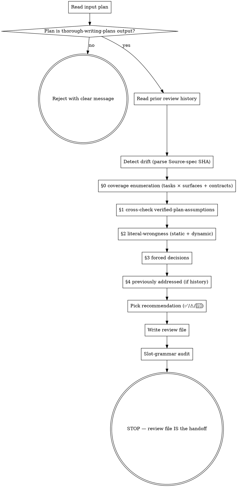

# Critical Implementation Review (v2)

## Overview

Adversarially review an implementation plan — typically produced by `thorough-writing-plans` — to surface things that would literally break the spec's stated outcome at execution time, plus forced decisions the plan silently picked. Empty output is a valid result; this skill exists to find real problems, not to demonstrate value.

CIR v2 is a ground-up rewrite of v1.6.0, replacing the persona / mandatory-scope-buckets / structurally-named-sections shape with the family pattern established by CDR v2: literal-wrongness test, four bounded finding categories, and explicit delegation of security and design concerns to other skills. Discipline emerges from these constraints — not from a "Senior Staff Software Engineer" persona.

## Shared discipline (read first)

Read `../critical-design-review/shared-review-discipline.md` (relative to this
skill's directory) before building §0. Its contents are binding for every review
this skill produces: reviewer mindset, the evidence-tier ladder (which binds
`ok` rows AND findings), negative-claims verification, the `Evidence:`-line
requirement on §2 fixes and §3 options, and the shared rationalization table.

## Checklist

Each item becomes a todo at skill-invocation time, in order:

0. Read `../critical-design-review/shared-review-discipline.md` — its rules (evidence tiers, negative claims, Evidence lines, shared rationalization table) are binding for this review.
1. Read the input plan end-to-end. Verify it's a `thorough-writing-plans` output (presence of `## Verified plan-level assumptions` header, case-insensitive); reject otherwise with the verbatim message in the "Input contract" section.
2. Read all prior review files matching `<plan-basename>-critical-review-*.md` in `docs/criticalreviews/`. Treat the combined content as the full history; never re-raise an issue already present in any prior review.
3. Detect drift: parse the plan's `**Source spec:**` header for a SHA (matches both `(commit SHA: <SHA>)` form when spec was tracked and `(uncommitted at plan-write time; repo HEAD = <SHA>)` form when spec was untracked). If `git -C <plan-dir> log --oneline <SHA>..HEAD` returns commits, emit a one-line drift note at the top of the review.
4. Build the §0 coverage enumeration (see "Coverage before candidates" below): one row per task × surface (step prose, code blocks, commands, wiring/integration text), one row per cross-task interface contract, both failure directions on rule-like content. In round N>1, build the enumeration BEFORE reading the prior round's diff in detail, then include the three mandatory row families — fix neighborhoods, intersected fix texts, amendment hunks (see Iterative review behavior).
5. Cross-check the plan's "Verified plan-level assumptions" section (§1 of output): for each assumption, perform a fresh read of the cited evidence; mark each as "still holds" or "failed (with new evidence at file:line)". Then the span check: name any plan dependency with no covering assumption — including dependencies the "Inherited from spec" list assumes but never states (a spec-level span gap otherwise passes through two review layers unexamined).
6. Work the §0 enumeration through the literal-wrongness test to surface §2 findings (literal-wrongness in the plan's tasks, code blocks, commands, ordering, signatures, consumer impact, race conditions in called primitives, error-path swallowing, integration edge cases at trust boundaries). Give every §0 row a disposition.
7. Surface §3 forced decisions the plan silently picked (real either/or where a codebase or product constraint forces a choice the plan hasn't named).
8. Surface §4 history (only if prior reviews exist) — bullets of items from the review history now resolved by the plan's current state.
9. Pick the recommendation per the bounded taxonomy (✅ / ⚠️ / 🛑).
10. Write the review file to `docs/criticalreviews/<plan-basename>-critical-review-N.md` (N = highest existing N for that basename + 1, or 1). Create the directory if it doesn't exist; never overwrite.
11. Run the slot-grammar audit on the written review file; print the one-line verdict (`Slot audit: pass` / `pass after N fixes` / `self-audit: …`) as terminal text.
12. STOP. The review file is the handoff — no execution-handoff message printed (mirrors CDR v2). Do NOT auto-invoke `update-implementation-plan` or any other downstream skill.

## Process flow



The terminal state is a **written review file**. Do NOT chain into `update-implementation-plan` / `subagent-driven-development` / anything else. The user decides what comes next.

## Input contract

### Acceptance check

Read the plan at the path the user provides (typically `docs/plans/YYYY-MM-DD-<topic>-implementation-plan.md` or similar). Look for these markers indicating it's a `thorough-writing-plans` output:

- A `## Verified plan-level assumptions` header (case-insensitive substring match for `verified plan-level assumptions` in any line starting with `#`)
- The structural shape of an implementation plan (file structure, tasks)

If absent, **reject** with this exact message shape:

> "This skill requires a plan produced by `thorough-writing-plans`. The file at `<path>` doesn't contain a 'Verified plan-level assumptions' section, which means its plan-level assumptions haven't been verified against the codebase. Re-run `thorough-writing-plans` against your spec first, then invoke this skill against the resulting plan."

No silent translation. No best-effort fallback for upstream `superpowers:writing-plans` plans, hand-written plans, or plan-shaped notes.

### Sub-edge case: section present but empty

If the section header is present but the section body has no assumption rows, accept; emit a top-of-review note:

> `Note: 'Verified plan-level assumptions' section is empty; §1 cross-check has nothing to verify.`

Don't reject — proceed with §2 / §3 / §4 review. (An empty section is anomalous but not impossible; e.g., a degenerate test fixture.)

### What CIR v2 trusts vs. verifies

- **Trusts** (does NOT re-verify): the plan's "Inherited from spec" assumptions (already verified by `thorough-brainstorming` at spec-write time and inherited intact by `thorough-writing-plans`). Stale only when the codebase has drifted significantly between spec-write time and review time — the drift note at the top of the review signals this.
- **Cross-checks fresh** (§1 of output): the plan's "Verified plan-level assumptions" table — performs a fresh read of each cited evidence reference; if the evidence still matches the assumption, mark "still holds"; if not, mark "failed (with new evidence at file:line)" and treat as a high-priority §2-equivalent.
- **Newly surfaces** (§2-§4): literal-wrongness, forced decisions, history.

## Out of scope for this skill

- **Comprehensive security review** is the `critical-security-review` skill's job. CIR v2 catches security issues only when they fail the literal-wrongness test against the spec's stated outcome (e.g., a SQL injection in the plan's own query that breaks the asked-for behavior). For threat modeling, authn/authz audit, dependency CVE checks, or trust-boundary analysis, run `critical-security-review` separately. Do NOT use CIR v2's literal-wrongness section as a back door for security findings the user didn't ask for.
- **Spec-level design concerns** (was the design itself right; architectural soundness; alternative architectures) are `critical-design-review`'s job, before the plan was written. CIR v2 reviews the implementation OF the design; it does not re-litigate the design.
- **Performing the tasks the plan describes** is out of scope — only review.

## Coverage before candidates (the enumeration sweep)

Precision machinery tells you what to drop; it does not tell you where to look. Before generating any candidate finding, enumerate the plan's review surface as a checkable list — this becomes §0 of your output:

1. **Tasks × surfaces:** one row per task per surface — step prose, code blocks, commands, and wiring/integration text each count as a surface. Step prose is not narration: derivation rules, classification logic, and parameter sourcing stated only in prose are executable content and break execution when wrong. The last tasks of the plan get the same depth of read as Task 1.
2. **Cross-task interface contracts:** one row per contract — every Consumes/Produces pair ("Task 4 consumes Task 3's `ProbeOutcome`"), every fixture handoff (an artifact one task writes and a later task reads: spike results → regression fixtures, generated files → test inputs), every parameter a task passes that another task must have defined. A contract's endpoint is an **operation**, not a task name: list the parameters the consuming operation requires and trace each to a field that exists in the artifact the producing task actually writes — dump a real record's key set where one exists; don't reason from the in-memory type of the same concept. Flag contracts that cross a persistence boundary. An operation with more than one caller in the plan gets **one row per call site**, not one per operation — each caller sources the operation's parameters from its own artifacts, and verifying sourcing once "for the operation" hides the caller whose inputs come from somewhere else. The canonical instance: an eval/spike-side replica of a runtime call — same operation, but its parameters come from persisted artifacts that may lack fields the runtime path holds in memory.
3. **Rule-like plan content:** any derivation/matching/classification rule stated in the plan (in prose or code) gets both failure directions checked — over-inclusion and under-inclusion — against the real inputs the plan will see, not hypothetical ones. Identity/exclusion rules (cache keys, dedup keys, self-match exclusion) are mandatory rows: calibration or later tuning sets *values*, it cannot repair *mechanics* — a key that conflates distinct entities is wrong at every value. For any eligibility predicate over a status or type, enumerate every producer of that status in the code — one row per producer; the input classes are what the code can emit, not what the plan lists.

Work through the enumeration; give every row a disposition — one line for non-load-bearing rows, the evidence-tier ladder in the shared discipline file for load-bearing ones: `ok — <what you checked>`, `→ §2/§3` (became a finding), or `dropped — <reason it failed literal-wrongness>`. Two disciplines on the rows themselves:

- **Proportionality:** the sweep scales with the artifact — a five-line plan gets a three-row sweep, not a template's worth of rows. §0 is a search discipline, not a form to fill; padding it with rows that check nothing is the same fabricated coverage as an unexamined `ok`.
- **Finish the surface:** a row that yields a finding is not thereby disposed. Before moving on, check the surface's remaining named identifiers — types, functions, exceptions, fixtures, columns — against the codebase. A found defect marks where the scan continues, not where it stops; the second phantom identifier in a code block routinely hides behind the first. **And the family:** a confirmed finding additionally obligates a recurrence sweep across the structurally similar siblings of the defective instance — enumerated and dispositioned per the population-closure section in `shared-review-discipline.md`. There is no enclosing-surface bound; the family lives in the codebase as much as in the artifact.

## Static AND dynamic mode-switch

§2 covers static AND dynamic correctness — code-block bugs, command typos, ordering deps, signature mismatches, consumer-impact regressions, *and* race conditions in called primitives, error-path swallowing, integration edge cases at trust boundaries. Both pass through the same literal-wrongness gate.

Don't skip the dynamic mode just because the static read finishes faster — the dynamic mode is where CIR catches what no upstream skill could. `thorough-writing-plans` already verifies the static plan-level assumptions (paths, signatures, commands, ordering, code-validity, consumer-impact) at plan-write time. If CIR v2's §2 is *also* primarily about static issues, CIR is mostly re-doing that verification as a fresh-eyes pass — useful but not distinctive. The runtime / integration-boundary perspective is what no upstream skill covers; that's the work that justifies the skill's existence.

The discipline emerges from this prose plus §2's worked examples (which cover both modes) — NOT from a separate §4 "Implementation-time edge cases" section. A separate § would prime filling and have an unfalsifiable discriminator (the agent can claim to have done the dynamic-mode work; nothing checks). A single §2 with both kinds of worked examples and an explicit mode-switch callout closes the structural slot.

The §0 enumeration sweep is how both modes reach every task: each task's rows get a static pass and a dynamic pass, so the last tasks of the plan receive the same treatment as the first, and the coverage is visible in the output rather than claimed. (The mode-switch was this skill's original falsifiability device on one axis; §0 generalizes it to the full surface.)

**Run what is runnable.** When a plan's code block is fully specified and its dependencies are importable in the local environment (installed wheel, repo module, on-disk fixture), execute it — or the smallest round-trip that exercises its real dependency — instead of inspecting it. Inspection catches name errors; execution catches shape errors: the union variant the code doesn't handle, the constructor that rejects the fake payload, the validator the fixture fails. This is CDR's "run R over the real corpus" applied to plan code; hand-tracing is the fallback when execution isn't cheap, not the default. A ten-line `python3 -c` against the installed SDK is in scope for a review; standing up services is not.

## Ruthless YAGNI for reviewers

A "good" CIR v2 review surfaces only what the user needs to know to make a good decision **about whether the plan correctly implements the spec**. It does not enumerate every adjacent improvement opportunity, every code-style preference, every hypothetical refactor. Treat additions to the review the way `thorough-brainstorming` treats additions to a design: every line must justify itself.

Specifically forbidden:

- Findings about scalability / extensibility / maintainability without a literal-wrongness justification
- Findings about features the plan didn't include — the plan implements the spec; if the spec didn't ask for it, neither should the review
- "We could also" / "we should also" / "it would be better to" framings
- Best-practice-as-correctness ("industry standard is X")
- Quota-driven critique ("I should find at least N issues to be useful")
- Re-raising items the §1 cross-check already settled
- Re-raising items that appeared in any prior review (resolved or not)
- Security findings that don't fail the literal-wrongness test — those are `critical-security-review`'s job
- "Adjacent FYIs" the user might find interesting — there is no FYI section
- Review of the design itself (alternative architectures, "this could have been structured differently") — that's `critical-design-review`'s job, before the plan was written

If a candidate finding doesn't fit one of the four finding categories below, drop it. There is no "miscellaneous notes" section. There is no "minor improvements" section. There is no "questions for clarification" section. **Empty is a valid output.**

## The literal-wrongness test

Apply this to every candidate finding before it appears in §2:

> **Would the spec's stated outcome be literally wrong, broken, or impossible at execution time without addressing this?**

If yes → §2.
If "this might be problematic," "best practice is," "to be safe," "the user might later want," or "industry standard is" — the finding is speculation. Drop it. Do NOT route it to a different section to keep it alive.

The "spec's stated outcome" is what the plan was written to deliver. CIR v2 doesn't re-question the spec; if the plan correctly implements an outcome the user asked for, the implementation is correct (regardless of whether the reviewer would have asked for a different outcome). When the plan's correctness depends on a primitive the plan calls, and the primitive is broken in a way that breaks the spec's outcome — that's §2. The fact that the bug lives in another file does not move the finding out of §2. Conversely, a primitive that is broken in ways that *don't* affect the spec's outcome is not a CIR finding at all (critical-security-review may catch it; CIR does not).

### Worked examples (static + dynamic, both qualify under the same test)

| Candidate finding | Literal-wrongness test | Verdict |
|---|---|---|
| **Static: code-block off-by-one** — Task 3's loop uses `i <= arr.length` (should be `<`) | Without addressing, does the plan's stated outcome work? No — the loop overruns by 1 on every execution. | §2 |
| **Static: command typo** — Task 5 says `pnpm test:units` (should be `test:unit`) | Without addressing, can the plan's command run? No — script doesn't exist. | §2 |
| **Static: hidden ordering dep** — Task 3 imports `formatRow` from `src/utils/format.ts` which Task 5 introduces | Without reordering, does Task 3 build? No — import resolves to nothing at Task 3 execution time. | §2 |
| **Static: signature mismatch** — Task 4 calls `getSession(req).userId` synchronously; the function returns `Promise<{userId}>` | Without addressing, does the destructure work? No — destructure happens before resolution. | §2 |
| **Dynamic: pool-slot leak** — Task 3 calls `pool.query` and `pool.release` in separate `await`s without `try/finally`. If `query` throws, the slot leaks; under any error rate, the pool exhausts and the handler stops working after N requests. | Without addressing, does the spec's outcome (handler returns response) work persistently? No — degrades and breaks within minutes under realistic error rates. | §2 |
| **Dynamic: error-path swallow** — Task 5's catch clause logs the error and returns `{}`; the spec said the handler returns the user's record or 404. | Without addressing, does the spec's outcome match what the caller sees? No — caller sees `200 {}` instead of either the record or a 404, breaking the contract. | §2 |
| **Dynamic: integration edge case** — Task 4's two-step `BEGIN; INSERT; COMMIT` opens a transaction without `try/finally ROLLBACK`; if `INSERT` throws, the connection is returned to the pool with an open transaction, which the next caller inherits. | Without addressing, does the spec's outcome (insert succeeds or fails atomically) hold for subsequent calls? No — subsequent callers get unexpected transaction state. | §2 |
| **Speculation: theoretical race** — "Could theoretically race under sustained 10k QPS load if many concurrent updates" | Concrete failure path? No — speculation about future load. | Drop. |
| **Speculation: futurology** — "If a future user adds X feature, this would need to change" | Concrete failure today? No. | Drop. |
| **Speculation: best-practice nit** — "Should add `Cache-Control: no-store` because it's PII" | Without it, does the spec's outcome (response body shape) change? No. | Drop. |
| **Re-raise** — A prior review already mentioned this issue | Re-raising violates CIR's iterative-review contract. | Drop. |

## The four finding categories

These are the only categories that exist. There is no "miscellaneous." No "Minor Issues & Improvements." No "Questions for Clarification." Each requires a *specific kind* of finding; none has a "fill this in" prompt.

| # | Category | What goes here | Output if empty |
|---|---|---|---|
| 1 | Verified-plan-assumptions cross-check | For each item in the plan's `Verified plan-level assumptions` table: does it still hold under a fresh read of the cited evidence? Then the **span check**: name any plan dependency with no covering assumption — a fact a task needs that no listed item (and no "Inherited from spec" item) verifies as scoped. Ground truth attaches to each listed item as written, not to the gaps between items. Bounded: one line per uncovered dependency; verify it in-round with read evidence, or — when it can't be verified — surface it as a §3 forced decision (verify empirically / accept the risk / defer). An unverifiable dependency never stays a §1-only note — that would let §5 read ✅ over an unverified load-bearing fact. Don't re-litigate listed items. Skip the entire section only if the input table was empty (with the note from the input-contract sub-edge case). | "All verified plan-level assumptions reconfirmed; span check found no uncovered dependency." |
| 2 | Literal-wrongness findings | Each candidate must pass the literal-wrongness test above. Covers static AND dynamic. Per item: description / evidence (file:line, exec output, or runtime trace) / proposed fix. | "No literal-wrongness findings." |
| 3 | Forced decisions | Real either/or the plan leaves unpicked, where a codebase or product constraint forces a choice the plan hasn't named. Reviewer surfaces the choice; never picks. Per item: the choice / why it's forced / the options. | "No forced decisions found." |
| 4 | Previously addressed (history) | Only present if prior reviews exist for this plan basename. Brief bullets on items from the review history that have been resolved by the plan's current state. | Section omitted entirely. |

**Notably absent from v2:**

- No "Overall Assessment" prose paragraph (CIR v1.6.0 §1) — speculative pad that fills with confident-sounding summary.
- No "Mandatory Scope of Review" 6-bucket checklist (CIR v1.6.0 lines 35-41) — invites filling all six buckets per review regardless of whether issues exist.
- No "Minor Issues & Improvements" section (CIR v1.6.0 §4) — open-ended invitation to fabricate; speculation passes through.
- No "Questions for Clarification" section (CIR v1.6.0 §5) — speculation about the plan-author's intent; not the reviewer's job.
- No "Implementation-time edge cases" §4 (despite the user-facing label being CIR's distinctive job). Folded into §2 — the literal-wrongness test catches both static and dynamic when the dynamic issue breaks the spec's outcome. Mode-switch is taught in prose (reviewer-mindset section + §2's worked examples), not by a structural slot. Closes the bucket-priming risk; mirrors CDR v2's "no fifth category" lesson.

## Recommendation taxonomy

Bounded set. No generic "Major revisions needed" fallthrough.

- ✅ **Approve as-is** — §1 has no failed assumptions; §2 and §3 are both empty. Plan is ready for `subagent-driven-development`.
- ⚠️ **Approve with literal-wrongness fixes** — §1 has failed assumptions OR §2 non-empty; §3 empty. User must address before SDD; may proceed afterward via `update-implementation-plan` (or manual edits).
- 🛑 **Surface forced decisions to user** — §3 non-empty (regardless of §1/§2 state). User input needed before SDD.

Disambiguation:

- §2 and §3 both non-empty → 🛑 (forced decisions block forward progress more strongly than literal-wrongness fixes).
- §1 failures are treated as high-priority §2-equivalent for recommendation purposes (mirrors UDD v2's handling).

(There is no 🚧 "Plan needs decomposition" — plans are 1:1 with specs by `thorough-writing-plans`'s contract; plan-decomposition isn't a thing here. If a plan really needs to be split, the underlying spec needs to be split first via thorough-brainstorming, not flagged from CIR.)

## Execution: fresh-context dispatch

Run the review as a fresh-context agent whose context is this skill (plus the shared discipline file), the artifact, and the codebase — nothing else. This is a mandatory-strength recommendation when the invoking session authored or last fixed the artifact: sweeps drift toward the newest edit, and a large share of late findings live in text the same session had just written. The review is non-interactive end-to-end, so dispatch changes no contract. When no subagent capability exists, run inline — the slot-grammar audit still applies.

## Iterative review behavior

- **Re-derive coverage every round.** In round N>1, complete the §0 enumeration sweep BEFORE reading the prior round's diff in detail. History tells you what's *resolved*, never what's *covered* — the CIR→UIP loop otherwise collapses each round's search to the last fix's neighborhood. Three row families are **mandatory rows** in round N>1 — rows inside the fresh sweep, never a substitute for it:
  - **(a) Fix neighborhoods:** each prior round's fix sites *and the artifact's restatements of them*.
  - **(b) Intersected fix texts:** any prior round's fix text whose claims intersect a later discovery — including probe results recorded in the paired artifact's reviews or Verified-assumptions rows for the same feature (spec ↔ plan reviews share probe evidence).
  - **(c) Amendment hunks:** commits touching the artifact since the previous review round whose messages do not match the update skills' commit shapes (`applied N fixes from …` / `snapshot before … applies N fixes from …`) are out-of-band amendments; their hunks are reviewed at fix-equivalent rigor — the amendment's own claims get population closure, a restatement check, and probes at the right altitude. Detection is anchored on the previous review's recorded anchor header, per "Amendment anchoring" below; round 1 skips (c) — it reviews the whole artifact anyway — but still records the anchor header.

  (Prior-review reading remains mandatory for the never-re-raise rule; it just happens after the enumeration is built.)
- **History awareness.** Read all prior reviews matching `<plan-basename>-critical-review-*.md` in the output directory. Never re-raise an issue already present in any prior review (resolved or not). If a prior issue is now confirmed as still wrong despite previous mention, surface it in §1 (cross-check) or §2 (literal-wrongness) only if the cited evidence has changed; do not duplicate.
- **Default output location:** `docs/criticalreviews/<plan-basename>-critical-review-N.md`, relative to the plan's repository root (or to current working directory as fallback if not in a repo). Create the directory if it does not exist. User preference overrides.
- **Numbering:** N is one higher than the highest existing N for that plan basename, or 1 if none. Never overwrite.
- **Collision-free with CDR v2 outputs:** CDR v2 writes `<spec-basename>-critical-review-N.md`; CIR v2 writes `<plan-basename>-critical-review-N.md`. By `thorough-writing-plans`'s naming convention, plan basenames carry the `-implementation-plan` suffix that spec basenames don't — the two never collide in the same directory.

**Amendment anchoring.** At round close, every review file records an anchor header in one of two forms, immediately after the `**Spec:**`/`**Plan:**` line:
- `**Artifact HEAD at review:** <sha>` — when `git log -1 -- <artifact>` yields a commit AND `git status --porcelain -- <artifact>` is empty (the working tree matches the committed state; the sha identifies the reviewed content).
- `**Artifact anchor at review:** content:<output of git hash-object <artifact>>` — otherwise: gitignored/untracked/non-repo artifacts (every git command in the graph stack succeeds-but-empty on ignored paths, so an empty result there is blindness, not absence), and tracked artifacts modified or staged at round close.

Round N>1 amendment detection, by the previous review's anchor form:
- **SHA anchor:** run the content-identity check on EVERY report — `git rev-parse <recorded-sha>:<artifact-path>` vs `git hash-object <artifact>`. Equal: no content amendment, proven at content level (forward-window commits are net-zero round-trips). Unequal: the authoritative amendment hunk set is `git diff <recorded-sha> -- <artifact>` — identical to the forward window plus working-tree diff on forward-only histories, and the only complete set when history moved backward — reviewed at fix-equivalent rigor, with in-band commits attributed via the forward window `git log <recorded-sha>..HEAD -- <artifact>` and, where the recorded sha has left HEAD's ancestry, the reverse window `git log HEAD..<recorded-sha> -- <artifact>`. A recorded sha that no longer resolves (pruned by a history rewrite) fails loudly: emit the content-anchor branch's `UNVERIFIED` residue row.
- **Content anchor:** recompute `git hash-object <artifact>`. Equal: no amendment, proven at content level. Different: an amendment occurred whose hunks and in-band/out-of-band attribution are mechanically unrecoverable — emit one explicit `UNVERIFIED` row naming that residue, flowing to §3 (verify with the user / accept / defer) exactly like an oversized population under population closure.

Never report an empty amendment set from an anchor class that cannot see amendments. Fallback when the previous review predates this slot or carries no anchor line: the mtime window `git log --since=<previous review file's mtime> -- <artifact>` — fallback only (blind to pulled amendments with pre-review committer dates and to mtime resets on fresh checkouts).

## Drift detection

Lightweight, signal-only — does not auto-re-verify spec-inherited assumptions.

### Header parsing

The plan's `**Source spec:**` header takes one of two forms (per `thorough-writing-plans`'s SKILL.md):

| Form | When emitted | SHA semantics |
|---|---|---|
| `` **Source spec:** `<path>` (commit SHA: <SHA>) `` | Spec is git-tracked at plan-write time | SHA = spec's last-modifying commit |
| `` **Source spec:** `<path>` (uncommitted at plan-write time; repo HEAD = <SHA>) `` | Spec is untracked (no commits exist for the spec file yet) | SHA = repo HEAD at plan-write time |

CIR v2's parser MUST handle both forms:

1. Try regex match for `\(commit SHA: ([a-f0-9]+)\)`.
2. If no match, try `` \(uncommitted at plan-write time; repo HEAD = `?([a-f0-9]+)`?\) ``.
3. If neither matches, skip drift detection (don't reject — the plan is still valid; just emit no drift note).

In both cases, the extracted SHA is the reference point for `git -C <plan-dir> log --oneline <SHA>..HEAD`. The semantic meaning differs slightly (last-modifying commit vs. plan-write-time HEAD), but the drift signal — "things have changed since the plan was written" — is what matters; both produce a useful commit list.

### Drift note format

If `git log --oneline <SHA>..HEAD` returns N > 0 lines, emit a one-line note immediately after the header block:

> `⚠️ N commits since plan-write time (SHA <plan-SHA>); cited file:line references re-checked under §1.`

If N == 0, no note.

If `git -C <plan-dir> rev-parse --is-inside-work-tree` returns false (plan is not in a git repo), skip drift detection silently.

## Slot-grammar audit

After writing the review file and before presenting, dispatch a small fresh-context agent whose only input is the written review file (no codebase access) to audit it against the slot grammar:
- every confirmed rule-vs-population mismatch has its matrix fully dispositioned (population closure);
- every load-bearing `ok` and every `Evidence:` line opens with a class tag whose shown evidence matches that class's tier;
- every rule-like row shows both failure directions;
- no `UNVERIFIED` row is dropped from §3 flow;
- the anchor header is present in one of its two forms.

Audit failures return to the reviewer to close before presenting. The audit checks grammar completeness only — it never re-litigates finding content. Fallback without subagent capability: a self-audit against the same checklist, labeled as such in the verdict line.

## Output format

````markdown
# Critical Implementation Review: <plan-basename> (Round N)

**Plan:** <absolute path>
**Artifact HEAD at review:** <sha> | **Artifact anchor at review:** content:<hash>
[Record exactly one form — the SHA form when `git log -1 -- <artifact>` yields a commit AND `git status --porcelain -- <artifact>` is empty (working tree matches the committed state); otherwise the content form.]
**Verified plan-level assumptions section:** present | empty | MISSING
[If MISSING: skill rejected before reaching this point — message printed in invocation, no file written]
[If empty: emit "Note: Verified plan-level assumptions section is empty; §1 cross-check has nothing to verify."]

[Drift note if applicable: ⚠️ N commits since plan-write time (SHA <plan-SHA>); cited file:line references re-checked under §1.]

## 0. Coverage enumeration
[One row per enumerated item — tasks × surfaces (step prose / code blocks / commands / wiring text), cross-task interface contracts (persistence-boundary handoffs flagged), rule-like content (both failure directions) — each with its disposition: `ok — <what was checked>` | `→ §2.n` / `→ §3.n` | `dropped — <reason it failed literal-wrongness>`]

## 1. Verified-plan-assumptions cross-check
[Per assumption (numbered, matching plan's table): still holds | failed (with new evidence at file:line)]
[Then span check: uncovered dependencies (one line each) | "span check found no uncovered dependency"]
[OR: "All verified plan-level assumptions reconfirmed."]
[Section omitted entirely if input table was empty]

## 2. Literal-wrongness findings
[Per finding (numbered): description / evidence (file:line or runtime trace) / proposed fix / the fix's own `Evidence:` line (or `UNVERIFIED:`)]
[OR: "No literal-wrongness findings."]

## 3. Forced decisions
[Per item (numbered): the choice / why it's forced / the options, each ending with its `Evidence:` line (or `UNVERIFIED:`) — reviewer surfaces, never picks]
[OR: "No forced decisions found."]

## 4. Previously addressed
[Only if prior reviews exist for this plan basename. Bullets of items from review history now resolved.]

## 5. Recommendation
[One of: ✅ Approve as-is / ⚠️ Approve with literal-wrongness fixes / 🛑 Surface forced decisions to user]
````

No issue IDs (mirror CDR v2; UIP v2 dispatches on section headers, not issue IDs). Findings are ordered/numbered bullets within each section.

## Anti-patterns

- DON'T propose architectural alternatives without a §2 finding to attach them to — and even then, alternatives belong in the §2 finding's proposed-fix prose, not as their own slot.
- DON'T add an "Out-of-scope findings" section, a "Minor Issues" section, a "Questions for Clarification" section, an "FYI" section, or any section not named in §1-§4. There are four finding categories. There is no fifth.
- DON'T re-raise issues from prior reviews.
- DON'T re-question items in the §1 cross-check unless the cited evidence has changed.
- DON'T play "Senior Staff Software Engineer" or any other expert-role framing.
- DON'T fabricate findings to fill empty sections. Empty is a valid output.
- DON'T mark a §0 row `ok` without naming what you checked — an unexamined `ok` is fabricated coverage.
- DON'T promote a §0 `dropped` candidate into §2 to make the sweep look productive — the literal-wrongness gate is unchanged.
- DON'T propose plan-decomposition (no analog to CDR v2's 🚧 — plans are 1:1 with specs).
- DON'T comment on variable names, micro-optimizations, or low-level implementation details that don't break the spec's outcome.
- DON'T perform any of the tasks described in the plan — only review.
- DON'T surface security findings that don't fail literal-wrongness — those are `critical-security-review`'s job.
- DON'T re-litigate the design — that's `critical-design-review`'s job, before the plan was written.
- DON'T auto-invoke `update-implementation-plan` or any other downstream skill. The review file IS the handoff.

## Reviewer rationalization table

The shared table in `../critical-design-review/shared-review-discipline.md` applies in full. CIR-specific rows:

| Thought | Reality |
|---|---|
| "I see a static issue in §2 already; the dynamic mode-switch is optional now." | §2 covers BOTH static and dynamic findings under the same gate. Even with one mode populated, the other mode's pass is still required. |
| "The step prose is just narration of the code blocks; reviewing the code covers it." | Derivation rules, classification logic, and parameter sourcing stated only in prose are executable content — real defects live in step prose and wiring text. Prose rows are mandatory. |
| "This Consumes/Produces line just names an object from an earlier task; no row needed." | Cross-task contracts are where plans break at execution time. One line to confirm the producing task actually defines what the consuming task uses. |
| "I've finished §2; UIP can pick up the findings now — let me invoke it." | The skill stops at the written review file. UIP is a separate user-directed step; CIR doesn't auto-chain. |
| "I read the code block carefully; the attribute paths all exist." | Inspection was `ok` twice on a block that failed on first execution. If the imports resolve locally, run it — the check costs less than the round it saves. |
