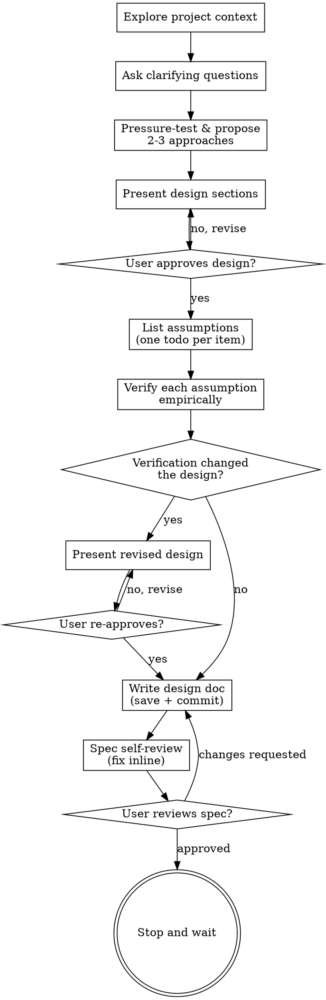

# Thorough Brainstorming: Ideas Into Designs (with Empirical Verification)

Help turn ideas into fully formed designs and specs through natural collaborative dialogue, then verify the load-bearing assumptions empirically before the spec is committed.

Start by understanding the current project context, then ask questions one at a time to refine the idea. Once you understand what you're building, present the design and get user approval. Then list every assumption the design depends on and verify each one against reality before writing the final spec. If verification changes the design, re-confirm with the user before writing.

<HARD-GATE>
Do NOT invoke any implementation skill, write any code, scaffold any project, or take any implementation action until you have presented a design, the user has approved it, the load-bearing assumptions have been verified, and the spec has been committed. This applies to EVERY project regardless of perceived simplicity.
</HARD-GATE>

## What's different from plain brainstorming

This skill adds **empirical assumption verification** between user approval and writing the spec. The cost is one extra pass; the payoff is that the spec on disk reflects the codebase that actually exists, not the codebase you assumed existed.

## Anti-Pattern: "This Is Too Simple To Need A Design"

Every project goes through this process. A todo list, a single-function utility, a config change — all of them. "Simple" projects are where unexamined assumptions cause the most wasted work. The design can be short (a few sentences for truly simple projects), but you MUST present it, verify its assumptions, and get approval.

## Checklist

You MUST create a todo for each of these items and complete them in order:

1. **Explore project context** — check files, docs, recent commits
2. **Offer the visual companion just-in-time** — NOT upfront. The first time a question would genuinely be clearer shown than described, offer it then (its own message); on approval its browser tab opens for you. If no visual question ever arises, never offer it. See the Visual Companion section below.
3. **Ask clarifying questions** — one at a time, understand purpose/constraints/success criteria
4. **Pressure-test and propose 2-3 approaches** — enumerate the decision axes, probe every differentiating claim, then present options with evidence-backed trade-offs, a `Probes:` block, and your recommendation (see "Exploring approaches (the fork contract)")
5. **Present design** — in sections scaled to their complexity, get user approval after each section
6. **List assumptions** — write each load-bearing assumption as a todo item before verifying any
7. **Verify each assumption empirically** — read code, run commands, check docs; mark each todo complete with the evidence found
8. **Re-confirm with user if anything changed** — if verification invalidated or shifted any assumption, present the revised design and get re-approval before writing
9. **Write design doc** — save to `docs/specs/YYYY-MM-DD-<topic>-design.md` and commit
10. **Spec self-review** — quick inline check for placeholders, contradictions, ambiguity, scope (see below)
11. **User reviews written spec** — ask user to review the spec file before proceeding
12. **Stop** — do NOT invoke any implementation skill. Wait for the user to direct what's next.

## Process Flow

**The terminal state is a committed, verified design document.** Do NOT chain into any implementation skill. The user decides what comes next.

## The Process

**Understanding the idea:**

- Check out the current project state first (files, docs, recent commits)
- Before asking detailed questions, assess scope: if the request describes multiple independent subsystems (e.g., "build a platform with chat, file storage, billing, and analytics"), flag this immediately. Don't spend questions refining details of a project that needs to be decomposed first.
- If the project is too large for a single spec, help the user decompose into sub-projects: what are the independent pieces, how do they relate, what order should they be built? Then brainstorm the first sub-project through the normal design flow. Each sub-project gets its own spec → plan → implementation cycle.
- For appropriately-scoped projects, ask questions one at a time to refine the idea
- Prefer multiple choice questions when possible, but open-ended is fine too
- Only one question per message — if a topic needs more exploration, break it into multiple questions
- Focus on understanding: purpose, constraints, success criteria

**Exploring approaches (the fork contract):**

The approaches message is the highest-leverage artifact in this skill: the user picks a branch based on the trade-offs you assert, and the post-approval verification pass only checks the branch that won — it cannot resurrect an option your framing killed. A trade-off asserted from memory at the fork is an unverified assumption that decides the design. So the fork gets the same empirical discipline as post-approval verification, resequenced in front of the decision:

1. **Enumerate decision axes before naming options.** List the dimensions the options consequentially differ on. The axes MUST include behavior under failure (for each way the thing can go wrong: what does the system actually do — retry, fail terminally, silently continue?) and downstream consumer behavior (what does the code that consumes this artifact do with each variant?), alongside whatever structural axis the options naturally frame themselves in. The decisive axis is routinely the one the natural framing omits.
2. **Probe every differentiating claim.** A differentiating claim is a factual assertion that changes which option wins: "X is blocked", "Y retries", "Z's errors are clearer", "the consumer handles both". Each gets probe-tier evidence: run a prototype against the real primitive, execute the command, read the actual consumer code path. Grep/diff is existence-tier evidence — it discharges "the symbol exists", never "the system behaves this way".
3. **Hybrid check.** After probing, answer in the message: does a combination of options dominate every pure option? Did any proposed component turn out option-independent (needed no matter which option wins)? Option-independent components leave the fork and apply to every branch.
4. **Present options conversationally with your recommendation**, leading with the recommended option and the probe evidence that picked it.

**The `Probes:` block (structural, checkable).** When any differentiating claim is behavioral, the approaches message MUST contain a block headed `Probes:` — one line per differentiating claim: the claim, what was run or read, and the decisive evidence (e.g. `plain union emits anyOf — ran build_tool on a prototype model, passes`), or `UNVERIFIED: <claim> — <why it couldn't be probed in-round>`. A trade-off that appears in the options but not in the Probes block is, visibly, an asserted guess — the block exists so the user can see at a glance which trade-offs are measured and which are hopes. If no differentiating claim is behavioral (the options differ only on preference, naming, or file layout), skip the block and the probes: present the fork directly. Do not pad preference forks with ceremony.

Red flags at the fork — these thoughts mean STOP:

| Thought | Reality |
|---|---|
| "I'll present the natural 2-3 shapes with trade-offs; verification comes after approval anyway" | Post-approval verification checks the branch that won — it cannot resurrect an option your unprobed framing killed. Probe the differentiating claims first. |
| "The user can ask me to pressure-test the options if they want more depth" | The user picks the branch from the message in front of them. A fork decided on unprobed claims is the failure, whether or not anyone asks for more. |
| "I already explored this area earlier in the session — or the handoff records it — so the claims are grounded" | Exploration establishes existence, not behavior. And a claim carried across rounds or a handoff is transcript-tier: the words survived, the verification didn't. Probe the claim in-round; it costs a minute. |
| "The trade-offs are well known for this kind of choice" | "Well known" is memory, not evidence. A fork decided on a wrong remembered claim costs the design. |

**Presenting the design:**

- Once you believe you understand what you're building, present the design
- Scale each section to its complexity: a few sentences if straightforward, up to 200-300 words if nuanced
- **Scale the approval cadence to the design's size.** For genuinely small designs, present the whole thing in one message and ask for one approval. For multi-component designs, present section by section and ask after each. Section-by-section approval is for catching wrong direction early on a large design — not for adding ceremony to a small one.
- **"Genuinely small" has a definition** — don't smuggle in larger work under the small-design exemption. A design qualifies as small only if ALL of these hold: one file or function changed; no new external dependency; no new route or endpoint; no schema or migration change; no new cross-cutting convention. If even one is false, present section by section.
- Cover: architecture, components, data flow, error handling, testing — but only the ones that apply. A 5-line config tweak doesn't have a "data flow."
- Be ready to go back and clarify if something doesn't make sense

**Design for isolation and clarity:**

- Break the system into smaller units that each have one clear purpose, communicate through well-defined interfaces, and can be understood and tested independently
- For each unit, you should be able to answer: what does it do, how do you use it, and what does it depend on?
- Can someone understand what a unit does without reading its internals? Can you change the internals without breaking consumers? If not, the boundaries need work.
- Smaller, well-bounded units are also easier for you to work with — you reason better about code you can hold in context at once, and your edits are more reliable when files are focused. When a file grows large, that's often a signal that it's doing too much.

**Working in existing codebases:**

- Explore the current structure before proposing changes. Follow existing patterns.
- Where existing code has problems that affect the work (e.g., a file that's grown too large, unclear boundaries, tangled responsibilities), include targeted improvements as part of the design — the way a good developer improves code they're working in.
- Don't propose unrelated refactoring. Stay focused on what serves the current goal.

## Ruthless YAGNI and Strict DRY

Every design proposed by this skill must solve **exactly the problem in front of you**, with the smallest possible footprint, using what already exists in the codebase. Over-engineering and speculation are this skill's most common failure modes — they show up as plausible-sounding additions that double the design surface for hypothetical benefit. Treat them as bugs in your own thinking.

### YAGNI — applies to every design choice

The default answer to every "should we also handle X?" is **no**, unless the user asked or X is a known correctness issue for the path they did ask for. Specifically, do NOT include in the design:

- Features the user didn't request — extensibility hooks, configuration options, "future-proofing"
- Error handling for scenarios that can't actually happen, or for failures handled at a system boundary you don't own
- Validation for inputs that internal callers control
- New abstractions over a single use case ("we might need this elsewhere later")
- Generic helpers when three similar lines would be clearer
- Configuration knobs nobody asked for — timeouts, retries, feature flags, env vars
- Backwards-compatibility shims for code paths that don't yet exist

When in doubt, the smaller design wins. The user can ask for more if they need more — and they can ask in seconds. Reversing an over-built design takes hours.

### DRY — applies during exploration, not as a refactor mandate

Before proposing any new code, helper, component, or convention in the design, check whether the codebase already has something that does the job:

- `grep` for existing utilities matching the responsibility (`getSession`, `formatError`, `withTransaction`, `pool.query`, etc.)
- Look for the convention the codebase already uses for the same kind of work — error shape, response shape, route registration, validation
- Reuse the existing helper even if it's slightly less elegant than one you'd design fresh

If existing helpers don't fit, propose new ones — but the design must briefly say *why the existing ones don't work* before introducing anything new. Do NOT use this as license for unrelated refactoring; if you find a duplication that isn't on the design's path, leave it alone.

### Speculative "out of scope" findings — apply the same filter

Verification turns up real issues. It also turns up plausible-sounding speculation — "what if the user later wants X?", "this could be extended to Y," "there's no audit trail / metric / cache." Apply YAGNI to your out-of-scope notes too.

**Surface only:**

- Latent bugs in code the design touches
- Security or correctness issues that affect the result the user asked for (auth forgery, injection, data loss, race conditions)
- Missing infrastructure that genuinely blocks the work (no router, no migration runner, missing dependency)
- Forced decisions a real codebase constraint imposes on the design

**Do NOT surface (these are noise):**

- "We could add observability / metrics / logging" — unless the user asked
- "We could refactor X for clarity" — unless X blocks the work
- "There's no test for Y" — unless the design needs the test to land
- "We should design for future flexibility around Z" — unless Z is on the user's stated roadmap
- "What if the requirements change to W?" — they haven't; design for what was asked

Your job is to surface what the user needs to know to make a good decision **about what they asked for**. Not to enumerate every adjacent improvement opportunity you noticed while reading the codebase.

### The "literal wrongness" test

Whenever you're tempted to label something a "correctness issue," "blocker," or "required for the user's use case" — apply this test:

> **Would the asked-for behavior be literally wrong, broken, or impossible without this?**

If yes → required, include or surface it.
If the answer is "this might be problematic in some scenarios," "it's best practice to," "the user might later want," "industry standard is," or "to be safe" — that's speculation. Drop it.

Worked examples (all from a real test of this skill):

| Candidate addition | Literal-wrongness test | Verdict |
|---|---|---|
| `Cache-Control: no-store` on `/health` because LB hits 8,640×/day | Without it, does the LB get the wrong answer? No — the LB still gets `200 {status: 'ok'}`. Whatever caching might happen doesn't change the asked-for response. | Speculation. Drop. |
| DB ping inside `/health` because "that's what health checks do" | Without it, does the LB's request fail? No — the response asked for is `{status: 'ok'}`, not a DB-status report. (Also: failing on DB blip would *break* the asked-for liveness behavior.) | Speculation. Drop. |
| Creating `app.ts` because no router exists anywhere | Without it, does the LB's request to `/health` ever reach the handler? No — there is no Express app to receive it. The asked-for behavior is literally impossible. | Required. Include. |
| Skipping `requireSession` on `/health` | Without it, can the unauthenticated LB get `200 {status: 'ok'}`? No — it would get 401. | Required. Include. |

The test is deliberately strict. "Best practice" and "to be safe" are not in it. If you can't say "the asked-for behavior literally fails," it's speculation — even if it would be a good idea in the abstract.

### YAGNI applies to design content, NOT to the discipline itself

Do not use YAGNI as an excuse to skip the verification step, the assumption list, the user-approval gate, or the spec write. Those aren't features of the design — they're the discipline that produces a correct design. A five-line endpoint still rests on assumptions; if those assumptions are wrong, the five-line endpoint is broken code regardless of how minimal it is. If you find yourself thinking "the design is too small to need verification" or "verification IS the over-engineering here," reread the "Too Simple to Need a Design" anti-pattern. It applies identically to verification.

### When "smallest design" and "fit existing patterns" collide

Sometimes the minimal design (e.g., an inline handler in `app.ts`) and the codebase convention (e.g., one handler per file in `src/api/`) point at different shapes. Tie-break: **prefer the smaller design unless the inconsistency would actively confuse a future reader of the codebase.** Convention is a means to readability, not an end in itself. Three lines of inline handler is fine; thirty lines of inline business logic that should clearly have been a module is not. When in doubt, smaller.

### Don't expand scope to justify surfacing findings

When verification turns up an issue that doesn't pass the YAGNI filter for surfacing, do not expand the design's scope so that it now "touches" that code and the finding becomes surfaceable. That's reverse-engineering scope from desired output. The scope is what the user asked for, not what would let you raise the topics you wanted to raise.

### Red flags for over-engineering

These thoughts mean STOP — you're proposing more than the user asked for:

| Thought | Reality |
|---|---|
| "This will probably be needed later, might as well design for it now" | Probably won't. Add it later if it turns out to be needed. The cost of adding later is small; the cost of dragging dead weight is permanent. |
| "I'll add a config option so it's flexible" | Flexibility you don't need is just code surface. Hard-code it; configurability can come later when there's a real second use case. |
| "Let me add error handling for all the edge cases" | Add error handling at system boundaries (user input, external calls). Don't add it for scenarios that can't happen. |
| "I should write a generic helper instead of duplicating this" | Three similar lines is better than a premature abstraction. Wait for the third real use case. |
| "We should also tackle [adjacent issue] while we're here" | Stay focused on what the user asked for. Surface the adjacent issue as a note (if it qualifies under the filter above), don't fold it into scope without permission. |
| "The spec should be exhaustive about edge cases the user didn't mention" | The spec should cover the path the user described. Edge cases come up during implementation — don't preempt them. |
| "I'll write a new helper because the existing one is slightly awkward" | Use the existing one. Slightly awkward beats duplicated logic. Refactor only if the design's correctness depends on it. |
| "I noticed this other thing wrong with the codebase, I should mention it" | Apply the filter: does it affect what the user asked for? If no, you're noise. |
| "Since I'm already touching this file, the marginal cost of also adding [X] is tiny" | Sunk-cost framing. Marginal cost is not zero — it's review surface, test surface, and a habit of letting "while we're here" creep into every change. If [X] wasn't asked for, leave it. |
| "The user asked for the simple version, but [Y] is what people *actually* mean by this — they just don't know the term" | Paternalism. The user said exactly what they meant. If you think they're missing something important, ASK them; do not silently translate their request into what you think they should have asked for. |
| "[X] would be more correct / safer / production-ready" | Apply the literal-wrongness test. If the asked-for behavior doesn't literally fail without [X], "more correct" is a value claim, not a correctness claim. Drop it. |
| "Verification is over-engineering for something this small" | YAGNI applies to design content, not to the discipline. Verify anyway. The verification list is exactly as long as the design's assumptions; a five-line design with five assumptions still has five things that could be wrong. |

## Empirical Assumption Verification

After the user approves the design and **before** writing the spec, verify the assumptions the design rests on. The goal: catch wrong-but-plausible assumptions while the design is still cheap to change.

### Step 1 — List assumptions explicitly (ALL of them, before reading any code for verification)

Track the list as todos — one todo per assumption. **Complete the entire list before you read a single file for verification purposes** — and definitely before you mark any item verified. Two patterns to avoid:

- **List-and-verify-each:** listing one assumption, verifying it, then listing the next. This lets you stop early once a few feel "fine" and miss the assumption you didn't think to question.
- **Verify-by-exploration-then-list:** opening files first to "get oriented" and then writing the assumption list. The enumeration is now colored by what you already saw — you list what you found instead of what the design depends on, and you'll silently drop assumptions whose answers you happen to have already absorbed. **Generate the list cold, against the design alone.** Then verify.

The list itself is a thinking artifact: forcing yourself to enumerate everything the design rests on is half the value.

Phrase each as a falsifiable statement, not a vague hope. Examples of well-formed assumption todos:

- "Verify: `src/auth/session.ts` exports `getSession()` returning `{ userId, expiresAt }`"
- "Verify: the project uses pnpm workspaces (not npm/yarn)"
- "Verify: `users` table has a `deleted_at` column we can soft-delete with"
- "Verify: the existing `BackgroundQueue` accepts jobs with arbitrary JSON payloads"
- "Verify: the React Router version is v6+ (loader-based data flow exists)"
- "Verify: nothing else in the codebase reads `is_active` in a way that breaks if we add a new state"

That last example is the kind of assumption agents routinely forget to list — "nothing else depends on this in a way I haven't accounted for." Add at least one of these per design.

**Recurrence direction (companion to the above).** The note above is the *dependents* direction — what else depends on something the design changes. The other direction is recurrence *within the design itself*: if any element (a type, a constraint, a schema choice, a per-member structure) is one instance of a set that recurs in this design, list the **whole set** as a single assumption and verify the design's claim holds for **every member present** — not just the one you wrote down. Draw the set at the broadest altitude at which the *same failure* applies (the meta-class), not a narrow sub-class, so a mix of sub-classes collapses into one check. Enumerate the members that actually appear in the design (a finite set, closed over the artifact); if the design uses a canonical-instance-plus-terse-deltas structure, expand the deltas first. If nothing recurs, this adds nothing.

**Some valid items aren't pure pass/fail.** Example: "Verify: the `users.email` UNIQUE constraint is compatible with soft-delete (otherwise we need to decide what to do with the email on delete)." Verifying this surfaces a forced design decision rather than a clean true/false. That's still a legitimate finding — flag it as a decision the user needs to make in Step 3.

If you can't phrase an assumption as something checkable (or as a state-of-the-codebase that forces a decision), it's either a value judgment (move on) or too vague (sharpen it first).

### Step 2 — Verify each one with evidence

For each todo, take one of these actions and record the evidence in the todo's completion:

| Assumption type | How to verify |
|---|---|
| A file/function/symbol exists with a given shape | `Read` the file, or `grep` for the symbol |
| A library/version is in use | Read `package.json` / `pyproject.toml` / `go.mod` etc. |
| A schema column/index/constraint exists | Read migrations, model files, or run a `\d table` if a DB is locally available |
| A pattern is followed elsewhere | `grep` for 2-3 examples; if you find none, the assumption is wrong |
| An external API behaves a certain way | Read its docs (WebFetch), or check existing callsites in this repo |
| A command/script works as expected | Run it (read-only commands only — don't mutate) |

**Do not mark a verification todo "complete" without recording the evidence.** "Looks fine" is not evidence. `src/auth/session.ts:42 — exports getSession() returning { userId, expiresAt, role }` is evidence.

### Step 3 — Update the design (and handle adjacent findings)

For each assumption that turned out wrong, partial, or different than expected:

- If the change is mechanical (e.g., function returns one extra field) — note it and continue
- If the change affects the design's shape (e.g., the queue doesn't accept arbitrary payloads, so we need a different mechanism) — **stop, revise the design, and re-present it to the user before writing the spec**
- If verification surfaced a **forced decision** (e.g., a constraint that means the user must pick path A or path B) — present the choice to the user before writing the spec. Don't pick silently.

**Adjacent / out-of-scope findings.** Verification often turns up issues that aren't part of the design's job. Before surfacing any of them, run them through the YAGNI filter above — if the finding is "we could improve X" rather than "X affects what the user asked for," it's noise; drop it. For findings that pass the filter, handle them by category:

| Finding (passes the YAGNI filter) | Action |
|---|---|
| Latent bug in code the design directly touches | Fold into the design as a side-fix; call it out explicitly to the user |
| Security/correctness issue or missing infrastructure that affects the user's stated result | Surface as a dedicated "Out of scope, but you should know" section in your message before writing the spec; let the user decide whether to expand scope |
| Convention drift (pattern half-followed) on code the design touches | Match whichever side of the drift is dominant and note it in the spec; do not silently re-establish the convention everywhere |
| New ambiguity the user never resolved | Ask the user; do not guess |

**Surface, don't bury.** Out-of-scope findings get their own visible section in your next message to the user — never just a sentence in the middle of the design prose. The user must be able to see them at a glance and decide. If you find a security issue (auth forgery, injection, secrets exposure), surface it even if the user has explicitly limited scope.

**If the user wants to ship anyway.** When verification surfaces a real problem and the user, after seeing it clearly, decides to ship the work as scoped — that's their call. Document the known issue in the spec under a "Known issues / accepted as out of scope" section with the user's name attached. Do not silently bury the finding to make the spec look clean.

Do not silently expand scope. Do not silently ignore.

### Concrete vignettes

**Vignette 1 — Schema assumption fails the design**

User wants soft-delete for users.
Assumption: `users` table has a `deleted_at TIMESTAMP NULL` column.
Verification: `Read` of the latest migration shows only `is_active BOOLEAN`.
Outcome: design changes from "filter on `deleted_at IS NULL`" to "either add a migration for `deleted_at` or use the existing `is_active`". Re-confirm with user which path they want.

**Vignette 2 — Library version assumption holds**

Design assumes React Router v6 loader-based data flow.
Verification: `Read` of `package.json` shows `"react-router-dom": "^6.20.0"`.
Outcome: assumption confirmed. Move on.

**Vignette 3 — "Pattern is followed elsewhere" assumption is wrong**

Design assumes errors are wrapped in a project-wide `AppError` type before being thrown.
Verification: `grep -r "new AppError" src/` returns 2 hits, and most thrown errors are raw `Error` or library errors.
Outcome: the convention isn't actually established. Either the design adopts plain errors to match reality, or it explicitly proposes establishing the `AppError` convention as part of the work — which is a scope change the user needs to weigh in on.

### Red flags during verification

These thoughts mean STOP — you're rationalizing your way out of the discipline:

| Thought | Reality |
|---|---|
| "I'm confident this is true, no need to check" | The check costs seconds. Designing on a wrong assumption costs much more. Check anyway. |
| "The user said they know the codebase, so I can trust their framing" | The user's framing is input, not ground truth. Verify against the codebase, not against confidence. |
| "We're under time pressure / it's just a demo" | Time pressure is exactly when wrong assumptions become production fires. The verification IS the time-saver. |
| "$NAME (tech lead / senior eng / the user themselves last week) already approved this design" | Third-party approval is hearsay; the only approval that satisfies the gate is from the user-in-this-session, after they've seen what verification turned up. Verify anyway, then re-confirm with them. |
| "The user explicitly told me to skip the verification step — that's consent" | The user can change scope; they cannot consent you out of the skill's discipline. Politely explain that verification will take ~60 seconds and almost always finds something. Do it. |
| "I'll list and verify one assumption at a time, it's the same thing" | No. Listing-then-verifying-each lets you stop early once a few feel fine. List ALL first; the enumeration itself surfaces things you'd otherwise miss. |
| "I'll just open the relevant files first to get oriented, then list assumptions" | That's verify-by-exploration-then-list. The list ends up describing what you saw, not what the design depends on. List cold, against the design alone, *then* read files. |
| "I verified by thinking about it / by remembering how this usually works" | That's not verification. Read the file or run the command. Evidence is a path + line, not a recollection. |
| "Most of the assumptions checked out, the rest are probably fine" | Verify all of them. The unverified one is the one that bites you. |
| "The assumption is too vague to verify" | Sharpen it. If you can't, it doesn't belong in the design. |
| "This finding is out of scope, I'll skip mentioning it" | Surface it as an out-of-scope note. The user decides scope, not you. |
| "I'll mention the latent bug in passing in the spec body" | Buried-in-prose ≠ surfaced. Out-of-scope findings get a dedicated section the user cannot miss; design-blocking findings stop the flow and require re-approval. |
| "It's so small, the assumption list would be longer than the code" | Then the design is wrong, not the discipline. Five-line endpoints sit on top of routing, auth, schema, error conventions — every one of those is an assumption. The list is exactly as long as it needs to be. |

## After Verification

**Documentation:**

- Write the validated design (spec) to `docs/specs/YYYY-MM-DD-<topic>-design.md`
  - (User preferences for spec location override this default)
- Use elements-of-style:writing-clearly-and-concisely skill if available
- Note in the spec which assumptions were verified and how (a short "Verified assumptions" section is enough — readers benefit from knowing what's been checked vs. taken on faith)
- Commit the design document to git

**Spec Self-Review:**
After writing the spec document, look at it with fresh eyes:

1. **Placeholder scan:** Any "TBD", "TODO", incomplete sections, or vague requirements? Fix them.
2. **Internal consistency:** Do any sections contradict each other? Does the architecture match the feature descriptions?
3. **Scope check:** Is this focused enough for a single implementation plan, or does it need decomposition?
4. **Ambiguity check:** Could any requirement be interpreted two different ways? If so, pick one and make it explicit.
5. **Verification trace:** Are the assumptions you verified reflected in the spec's claims about the codebase?

Fix any issues inline. No need to re-review — just fix and move on.

**User Review Gate:**
After the spec review loop passes, ask the user to review the written spec:

> "Spec written and committed to `<path>`. Assumptions were verified against the codebase (see the 'Verified assumptions' section). Please review and let me know if you want any changes. When approved, the typical next step is `critical-design-review` against this spec."

Wait for the user's response. If they request changes, make them and re-run the spec review loop. Only stop once the user approves.

**After approval — STOP:**

The skill ends here. Do NOT invoke critical-design-review, writing-plans, frontend-design, mcp-builder, or any other downstream skill on your own. Wait for the user to direct what comes next.

## Key Principles

- **One question at a time** — Don't overwhelm with multiple questions
- **Multiple choice preferred** — Easier to answer than open-ended when possible
- **YAGNI ruthlessly, DRY strictly** — Solve exactly the problem in front of you with the smallest possible footprint, using what already exists. See the "Ruthless YAGNI and Strict DRY" section — this is enforceable, not aspirational.
- **Explore alternatives** — Always propose 2-3 approaches before settling, with differentiating claims probed, not asserted
- **Incremental validation** — Present design, get approval before moving on
- **Evidence over confidence** — Every load-bearing assumption gets verified against the real codebase, not against your memory of how things usually work
- **Be flexible** — Go back and clarify when something doesn't make sense

## Visual Companion

A browser-based companion for showing mockups, diagrams, and visual options during brainstorming. Available as a tool — not a mode. Accepting the companion means it's available for questions that benefit from visual treatment; it does NOT mean every question goes through the browser.

**Offering the companion (just-in-time):** Do NOT offer it upfront. Wait until a question would genuinely be clearer shown than told — a real mockup / layout / diagram question, not merely a UI *topic*. The first time that happens, offer it then, as its own message:
> "This next part might be easier if I show you — I can put together mockups, diagrams, and comparisons in a browser tab as we go. It's still new and can be token-intensive. Want me to? I'll open it for you."

**This offer MUST be its own message.** Only the offer — no clarifying question, summary, or other content. Wait for the user's response. If they accept, start the server with `--open` so their browser opens to the first screen automatically. If they decline, continue text-only and don't offer again unless they raise it.

**Per-question decision:** Even after the user accepts, decide FOR EACH QUESTION whether to use the browser or the terminal. The test: **would the user understand this better by seeing it than reading it?**

- **Use the browser** for content that IS visual — mockups, wireframes, layout comparisons, architecture diagrams, side-by-side visual designs
- **Use the terminal** for content that is text — requirements questions, conceptual choices, tradeoff lists, A/B/C/D text options, scope decisions

A question about a UI topic is not automatically a visual question. "What does personality mean in this context?" is a conceptual question — use the terminal. "Which wizard layout works better?" is a visual question — use the browser.

If they agree to the companion, read the detailed guide before proceeding:
`visual-companion.md` (in this skill's own directory).
