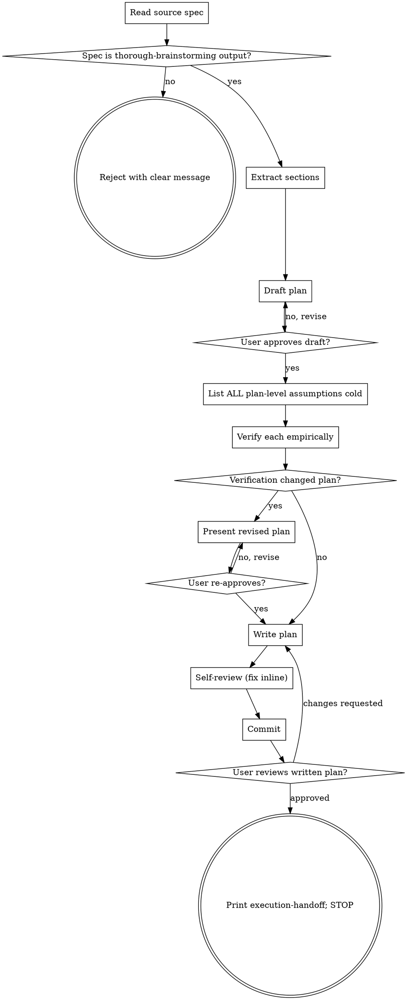

# Thorough Writing Plans: Verified, Minimal Implementation Plans

Convert a verified design spec into a step-by-step implementation plan. Trust the spec's verified assumptions as ground truth; verify the NEW assumptions the plan introduces (paths, signatures, commands, ordering, code validity, consumer impact). Apply ruthless YAGNI / strict DRY to plan content. Stop at a committed plan; do not invoke downstream skills.

<HARD-GATE>
Do NOT invoke `critical-implementation-review`, `critical-security-review`, `update-implementation-plan`, `subagent-driven-development`, or write any code, until you have read the spec, drafted the plan, listed and verified every plan-level assumption, presented the plan for user approval, and committed it. This applies to EVERY plan regardless of perceived simplicity.
</HARD-GATE>

## What's different from `superpowers:writing-plans`

This skill adds:
1. **Strict input contract** — only accepts a thorough-brainstorming spec as input (rejects bare prompts, ad-hoc requirements, or older spec formats).
2. **Plan-level empirical verification** — every assumption the plan introduces (paths, signatures, commands, ordering, code-in-plan validity, consumer impact) is verified against the real codebase before commit.
3. **Trusts spec's verified assumptions** — does NOT re-verify what thorough-brainstorming already verified. Reads the spec's "Verified assumptions" section as ground truth.
4. **Ruthless YAGNI / strict DRY adapted to plans** — no speculative tasks, no premature task splitting, no invented test infrastructure, no "while we're here" refactors.
5. **HARD-GATE on downstream chaining** — does not auto-invoke CIR / critical-security-review / UIP / SDD. Stops at a committed plan.

The cost is one extra pass. The payoff is a plan whose tasks reference real paths, real signatures, real commands — not what the agent assumed they were.

## Anti-Pattern: "This Plan Is Too Simple To Need Verification"

A one-line config tweak still rests on assumptions: the file is at the path you cited, the build command is what you wrote, the value's type matches the schema. The plan can be short, but you MUST list and verify its assumptions and get approval. Plan size has zero correlation with assumption-count's relevance.

## Checklist

Create a TodoWrite task per item, in order:

1. **Read the source spec end-to-end.** Verify it's a thorough-brainstorming output (look for a "Verified assumptions" section); reject otherwise with a clear message (see "Spec input contract" below).
2. **Extract from the spec:** design body, verified-assumptions list, out-of-scope list (if present), known-issues list (if present). Treat verified assumptions as ground truth.
3. **Draft the plan:** file structure, task decomposition, code blocks, test/lint/build commands, task ordering. Apply ruthless YAGNI / strict DRY (see below).
4. **Present the draft to the user for approval.** Section by section if multi-component; whole-thing if genuinely small (per thorough-brainstorming's small-design definition: one file, no new dependency, no new route, no schema change, no new convention).
5. **List ALL plan-level assumptions cold (TodoWrite per item),** against the draft plan only, BEFORE reading any code for verification.
6. **Verify each assumption empirically with evidence** (path:line, command output excerpt, grep result). Record evidence in the todo's completion.
7. **If verification changed the plan:** revise and re-confirm with user before writing.
8. **Write the plan** to `docs/plans/YYYY-MM-DD-<topic>-implementation-plan.md`.
9. **Plan self-review** (placeholders, internal consistency, type/signature consistency, scope-vs-spec, verification trace).
10. **Commit** the plan to git (or warn + offer `.bak` if not in git repo).
11. **Ask user to review the written plan;** iterate if changes requested.
12. **STOP.** Print the execution-handoff message. Do NOT invoke any downstream skill.

## Process Flow



The terminal state is a **committed, verified implementation plan**. Do NOT chain into CIR / critical-security-review / UIP / SDD. The user decides what comes next.

## Spec Input Contract

### Acceptance check (Step 1)

Read the spec at the path the user provides (typically `docs/specs/YYYY-MM-DD-<topic>-design.md` or similar). Look for these markers indicating it's a thorough-brainstorming output:

- A `## Verified assumptions` section (or close variant containing "Verified" in a heading)
- The structural shape of a design spec

If absent, **reject** with this message shape:

> "This skill requires a spec produced by `thorough-brainstorming`. The file at `<path>` doesn't contain a 'Verified assumptions' section, which means its assumptions haven't been empirically verified against the codebase. Re-run `thorough-brainstorming` against your idea first, then invoke this skill against the resulting spec."

No silent translation, no best-effort fallback.

### Sections to extract (Step 2)

| Spec section | Mandated by thorough-brainstorming? | What to do with it |
|---|---|---|
| Design body (Architecture / Components / etc.) | Implicit | Drives task decomposition. The plan implements this. |
| `Verified assumptions` | **Yes** | **Ground truth.** Do NOT re-verify. Reference in plan's "Inherited from spec" section. |
| `Out of scope` | **No** (conditional) | If present, enforce as "Tasks NOT in this plan" subsection in plan output, **preserving the spec's original form** — prose stays prose, bullets stay bullets. If absent, omit the subsection entirely (no template forcing). |
| `Known issues / accepted as out of scope` | **Conditional** | Preserve verbatim in plan's "Known issues inherited from spec" section — same form as the source spec (prose-as-prose, bullets-as-bullets). Do NOT silently fix. |
| Anything else | N/A | Read for context; don't reify into tasks. |

### What the plan inherits vs. what it newly introduces

- **Inherits from spec** (DO NOT re-verify): which files conceptually exist, library versions, established conventions (e.g., "errors use AppError"), schema shape.
- **Newly introduces** (MUST verify): exact file paths for new files, exact code in code blocks, exact commands, exact function signatures called from new code, task ordering with dependencies, consumer impact.

### Drift detection (lightweight)

Compare the spec's last-modifying commit (`git log -1 --format=%H -- <spec-path>`) to current HEAD. If commits exist between, mention it as a one-line note to the user. Do NOT automatically re-verify spec-level assumptions — drift is the user's call to flag.

**If the spec is untracked** (no commits exist for the spec file yet — `git log` returns empty for it): record `(uncommitted at plan-write time; repo HEAD = <HEAD-SHA>)` in the plan's "Source spec" header instead of a SHA. Don't refuse to proceed; the spec's content matters more than its commit state. Mention to the user that the spec they're consuming isn't tracked, in case they want to commit it before proceeding.

### No template forcing

If the spec doesn't have an "Out of scope" or "Known issues" section, don't fabricate empty ones in the plan output. Mirror the spec's actual content; only add plan-specific sections when there's content for them.

## Plan-Level Assumption Verification (the core)

Spec-level assumptions are already verified by thorough-brainstorming. Plan-level assumptions are what nothing currently catches — and they're what cause "the plan looked great but Task 3 imports a function that doesn't exist with that signature" failures.

### Six categories

Every assumption you list during Step 5 should fall into one of these:

| # | Category | Example (well-formed, falsifiable) |
|---|---|---|
| 1 | File paths exist where the plan says they do | "Verify: `src/auth/session.ts` exists at exactly that path with that name (not `Session.ts`, not `src/auth/sessions.ts`)" |
| 2 | Function/method/symbol signatures match what the plan's code blocks call | "Verify: `getSession()` in `src/auth/session.ts:42` returns `Promise<{userId: string, expiresAt: Date}>` — Task 2 destructures `userId` synchronously, which is wrong if it's a Promise" |
| 3 | Test / lint / build / type-check / commit commands exist and run as written | "Verify: `pnpm test:unit src/auth/session.test.ts` is a valid invocation in this repo (test runner: pnpm? npm? yarn?; script name?)" |
| 4 | Task ordering has no hidden cross-dependency | "Verify: Task 3 (creating `src/api/users/me.ts`) does not import anything Task 5 introduces; if it does, reorder" |
| 5 | Code in plan body is syntactically/semantically valid against actual lib versions | "Verify: Task 4 uses `useLoaderData()` — confirmed React Router v6.20+ in spec; now also verify import path is `react-router-dom` not `react-router`" |
| 6 | Touched-function consumers don't break in ways the spec didn't surface | "Verify: changing `formatError(err)` to `formatError(err, opts)` in Task 6 — grep callers; spec verified the convention exists, but didn't enumerate callers" |

### Conditional Cat 6 mandate

**If any task in the plan has a `Modify:` file entry** (i.e., the plan touches existing code), add **at least one Category 6 assumption**. If the plan is create-only (every task has only `Create:` entries, no `Modify:`), Cat 6 is not required. (Self-checking — trivially verified by scanning the plan's own task headers.)

### List ALL cold, then verify

Same discipline as thorough-brainstorming, retargeted:

- **List-then-verify-each (BAD):** lists one, verifies it, lists the next. Stops early once a few feel "fine".
- **Verify-by-exploration-then-list (BAD):** opens code first to "get oriented," then writes the list. The list ends up describing what was found, not what the plan rests on.
- **List ALL cold (REQUIRED):** generate the entire list against the draft plan only, before reading any code for verification. Then verify each.

Use TodoWrite. One todo per assumption. Phrase as a falsifiable statement.

### Sibling-set sweep (rides on top of all six categories)

Some assumptions are about one member of a set that recurs in the plan — a type or identifier referenced across tasks, a constraint or version reused, a command repeated per task, a signature with many callers, a per-member task decomposition. For those, list and verify the **whole set present in the plan**, not just the instance in front of you.

- **Draw the set at the meta-class altitude.** Define the recurring class at the broadest altitude at which the *same failure* applies — e.g. "every referenced name resolves to a definition at its point of use," not the narrow "`@ManyToOne` forward-refs." A sub-class-altitude sweep catches that sub-class's siblings but drip-feeds across the *other* sub-classes of the same failure; only the meta-class altitude collapses a mixed-sub-class plan into one pass. Stays bounded by a single named failure mode — not "everything that could be wrong."
- **Cat 6 already does this for callers; this generalizes the move** to types, identifiers, constraints, commands, and per-member tasks.
- **Delta-expansion first.** If the plan uses a canonical-task-plus-terse-deltas structure ("T3-T11 narrate ONLY the deltas from T2"), expand each delta against its canonical **before** listing assumptions, so references hidden in the deltas reach the sweep.
- **Bounded:** enumerate only siblings that actually appear in the plan; if the subject appears once, there is no set and the sweep adds nothing; a sweep that confirms every sibling already correct is a successful, finding-free sweep (no quota; empty stays valid).

### How to verify each (evidence shapes)

| Assumption type | How to verify | Evidence form |
|---|---|---|
| File path exists | `Read` the file or `find` for it | `path/to/file.ts:1` exists, X bytes |
| Function signature matches | `Read` the file at the cited line, or `grep` for the symbol | `src/auth/session.ts:42` exports `async function getSession(): Promise<{userId, expiresAt}>` |
| Test/lint/build command | Read `package.json` scripts / `Makefile` / equivalent. **Don't actually run mutating commands.** Read-only OK. | `package.json:scripts.test` is `"vitest run"`, not `"jest"` |
| Task ordering | For each task, `grep` its imports against later tasks' newly-created symbols | Task 3 imports `formatError` from `src/errors.ts:1`; that file is pre-existing, not introduced by Task 5 |
| Code-in-plan validity | `Read` the lib's `package.json` version + `grep` 2-3 existing callsites | `react-router-dom: ^6.20.0`; `useLoaderData` used at `src/routes/Foo.tsx:14` with the same import path |
| Consumer-impact | `grep -r "<symbol>" src/` for callers; check whether plan-change breaks each | 3 callers of `formatError`; 2 pass 1 arg, plan adds optional opts → backwards-compat |

**"Looks fine" is not evidence.** Every verification todo's completion must record a path:line, a command output excerpt, or a grep result.

### When verification changes the plan (Step 7)

| Outcome | Action |
|---|---|
| Mechanical fix (e.g., function returns extra field; plan code-block destructure works fine if you ignore it) | Update the relevant task's code block silently; note in the verified-assumptions section. Continue. |
| Plan-shape change (e.g., `BackgroundQueue` doesn't accept arbitrary payloads; need different mechanism affecting multiple tasks) | **Stop.** Revise the plan. Re-present to user. Get re-approval before writing. |
| Forced decision surfaced (e.g., "the existing `formatError` convention varies; Task 6 needs to either match each callsite individually OR establish unified shape") | Present the choice to the user. **Do not pick silently.** |

### Adjacent / out-of-scope findings

Apply the YAGNI filter (see "Ruthless YAGNI" section below) **before** surfacing any out-of-scope finding.

| Finding (passes YAGNI filter) | Action |
|---|---|
| Latent bug in code the plan directly touches | Fold a fix-task into the plan; call out explicitly to user |
| Security/correctness issue in code the plan touches | Surface as a dedicated "Out of scope, but you should know" section in the message before writing the plan; user decides |
| Convention drift in code the plan touches | Match dominant side; note in plan; don't silently establish convention everywhere |
| New ambiguity not resolved in spec | Ask user; don't guess |

**Do NOT surface (noise):** "We could add metrics", "we could refactor X for clarity", "there's no test for Y" — unless the literal-wrongness test passes (would the plan's stated outcome be literally broken without it?).

### Red flags during verification

| Thought | Reality |
|---|---|
| "The spec already verified this; no need to verify the file path the plan cites" | The spec verified `src/auth/session.ts` exists. The plan adds a NEW path the spec didn't cover. That's a plan-level assumption. Verify it. |
| "Task ordering is obvious" | The one task whose hidden dependency you missed is the one that breaks the build at execution time. Verify ordering explicitly. |
| "I'll just write the test command from memory — `pnpm test` works in most projects" | Read `package.json`. Many projects use `pnpm test:unit`, `pnpm vitest`, or have no `test` script at all. |
| "The function signature in my code block is what it usually is" | "Usually" is not evidence. Read the file. |
| "Subagent-driven-development will catch this" | SDD catches it at the cost of a fresh subagent burning context to re-discover what verification could have caught for free. |
| "The plan is so small the assumption list is overkill" | A 3-task plan with 1 file path + 2 function calls + 1 test command + 1 ordering claim still has 5 assumptions. List them. |

## Ruthless YAGNI / Strict DRY (Adapted to Plans)

The mechanism is the same as in thorough-brainstorming — but the over-engineering patterns at the **plan** level are different from the design level. Plans tempt you to invent tasks, split tasks, add scaffolding, and over-specify ordering in ways the spec didn't authorize.

### YAGNI applied to plan content

The default answer to "should the plan also have a task / step / helper for X?" is **no**, unless the spec called for X or X is a known correctness issue for the path the spec did call for. Specifically, do NOT include:

- **Tasks the spec didn't authorize** — observability, metrics, logging, monitoring, alerting, dashboards, audit trails, feature flags, telemetry, OpenAPI/API docs, CHANGELOG entries, README updates, "while we're here" refactors of adjacent code.
- **Premature task splitting** — three tasks named "Define types / Implement function / Add tests" should usually be ONE task with four steps. Splitting fragments review surface, multiplies per-task ceremony, and pretends decomposition where there's only sequencing.
- **Premature helpers in code blocks** — if a code block in Task 3 introduces `withTransaction(fn)` to wrap a single use case, inline the transaction handling. Extract a helper when there's a third real callsite.
- **Invented test infrastructure** — new test harnesses, mock factories, fixtures, test categories when 2-5 lines of inline setup using the codebase's existing convention would do.
- **Invented build/lint/CI knobs** — new lint rules, build scripts, CI steps, env-var toggles unless the spec asked.
- **Premature task ordering rigidity** — declaring "Task 4 must run after Task 2" when they're actually independent (wastes SDD's per-task-fresh-subagent parallelism opportunity), or declaring sequence when ordering is genuinely arbitrary.
- **Dead-code preparation** — "Task N: define interface so future implementations can swap" — there is no future implementation today.
- **Layered test types** — integration + unit + e2e all for the same behavior. Pick the ONE level appropriate to what's being tested.
- **Defensive scaffolding** — null-checks, type guards, prop-types, JSDoc validation on internal-only code where the codebase doesn't already do this. Match what's there.
- **Steps that test the framework, not the code** — "Step: assert React renders the component" duplicates React's own tests. Test what your plan introduces.

### DRY applied during plan-drafting (not as a refactor mandate)

Before adding any new code block, helper, test fixture, command invocation, file-organization convention, or commit message format to the plan, check whether the codebase already has the equivalent:

- `grep` for existing helpers (`getSession`, `formatError`, `withTransaction`, `pool.query`, `expectError`, `mockSession`)
- Read existing test files for fixture / mock / setup conventions before inventing new ones
- Read `package.json` scripts (or `Makefile` / `justfile` / equivalent) for the test, lint, build, type-check commands the codebase actually exposes
- Read `git log --oneline -20` for existing commit-message conventions before specifying a new format
- Match the codebase's file-organization convention (route handlers in `src/api/`, not `src/handlers/`, if that's what's there)

If existing helpers / commands / conventions don't fit, the plan can introduce new ones — but the plan must briefly say *why* the existing ones don't work before doing so. Do NOT use this as license for unrelated refactoring.

### The literal-wrongness test (retargeted to plan content)

> **Would the spec's stated outcome be literally wrong, broken, or impossible without this task / step / helper / refactor?**

If yes → required, include in plan.
If "more correct," "more robust," "more production-ready," "best practice," "industry standard," "to be safe" — speculation. Drop.

**Worked examples:**

| Candidate plan addition | Literal-wrongness test | Verdict |
|---|---|---|
| "Task N: add Sentry instrumentation to the new endpoint" because best practice | Without it, does endpoint return spec's stated response? Yes. | Speculation. Drop. |
| "Task N: write a CHANGELOG.md entry for this feature" | Without it, does the feature work? Yes. | Speculation. Drop. |
| "Step: run prettier on touched files" when codebase has no prettier | Without it, does the code work? Yes. Codebase reject unprettified code? No. | Speculation. Drop. |
| "Step: run prettier on touched files" when codebase has prettier in pre-commit hook | Without it, does the commit succeed? **No** — pre-commit hook fails. | Required. Include. |
| "Task: add a `BackgroundJob` interface" because plan introduces one job and "we'll probably want more later" | Without it, does the one job work? Yes. | Speculation. Drop. |
| "Task: create migration adding `users.deleted_at`" when spec said soft-delete will use this column | Without it, does Task 4 (`WHERE deleted_at IS NULL`) work? **No** — column doesn't exist. | Required. Include. |

### Red flags during plan-drafting

| Thought | Reality |
|---|---|
| "I'll split this into 3 tasks for clarity" | If each split doesn't make sense as a self-contained, reviewable, independently-revertable unit, you're fragmenting not decomposing. Combine. |
| "I'll add an interface so future implementations can swap" | YAGNI. Add when the second implementation arrives. |
| "Let me add a feature flag so we can roll back" | Rollback is `git revert`. Feature flags add real surface (config, two paths, two test paths, removal-debt). Add only if asked. |
| "I should add observability / logging / metrics to this new code" | Unless the spec asked, no. The spec is what the user asked for; additions are paternalism. |
| "Tests should cover edge cases the spec didn't list" | Tests cover the path the spec described. Edge cases discovered during implementation get TDD'd against then; not pre-enumerated. |
| "I'll write unit + integration + e2e for this same behavior" | Pick the ONE level appropriate. The codebase's existing test convention tells you which. |
| "I should add JSDoc / TypeScript-strict / prop-types to all new code" | Match the codebase's existing strictness, don't ratchet up unilaterally. |
| "I'll add a wrapper around the existing helper because its name is awkward" | Use the existing helper. Slightly awkward beats duplicated logic. |
| "While I'm modifying this file, I should also fix [unrelated thing]" | Stay scoped. If [unrelated thing] passes the YAGNI filter for surfacing, surface it as out-of-scope. Don't fold in. |
| "The spec didn't say to do X, but the user *clearly* meant X" | Paternalism. The spec said what it said. ASK; don't silently extend. |
| "Verification is overkill for a 2-task plan" | A 2-task plan has, at minimum: 2 file paths, 1+ function calls, 1+ test commands, 1 ordering claim. Verify them. |
| "Subagent-driven-development will catch this at execution time" | Yes, at the cost of a full subagent context. Catch at plan-write time for free. |

## Output Format

### Path

`docs/plans/YYYY-MM-DD-<topic>-implementation-plan.md`
(User can override; default applies otherwise.)

### Versioning

**No version field anywhere** — not in filename, not in frontmatter, not in body header. The plan is a canonical artifact at one path; revision history lives in git. (Same pattern as thorough-brainstorming + update-design-doc v2.)

### Frontmatter

Empty or minimal. No `version`. No `parameters:` (non-standard per agentskills.io spec).

### Body structure (in this order)

```markdown
# [Feature Name] Implementation Plan

> **For agentic workers:** REQUIRED: Use `superpowers:subagent-driven-development` to implement this plan. Steps use checkbox (`- [ ]`) syntax for tracking.

**Source spec:** `docs/specs/YYYY-MM-DD-<topic>-design.md` (commit SHA: `<spec-SHA-at-plan-write-time>`)

**Goal:** [one sentence — derived from spec]

**Architecture:** [2-3 sentences — derived from spec]

**Tech stack:** [key technologies/libraries — derived from spec's verified assumptions]

---

## File Structure
[Map files created/modified by tasks. One clear responsibility per file.
Format: bullet list grouped by Create / Modify / Test, with one-line purpose each.]

## Inherited from spec
The following assumptions were verified by `thorough-brainstorming` at spec-write time
and are NOT re-verified here. Trusted as ground truth:
- [verbatim items from spec's "Verified assumptions" section, each with original evidence reference]

## Verified plan-level assumptions
Newly introduced by this plan (paths, signatures, commands, ordering, consumer impact)
and verified at plan-write time:

| # | Category | Assumption | Evidence |
|---|---|---|---|
| 1 | File path | `src/api/users/me.ts` will be a new file (Task 3 creates it) | `find src/api -name "me.ts"` returned no results |
| 2 | Function signature | `getSession()` at `src/auth/session.ts:42` returns `Promise<{userId, expiresAt}>` | Read of file at line 42 |
| ... | ... | ... | ... |

## Tasks

### Task 1: [Component Name]

**Files:**
- Create: `exact/path/to/file.ts`
- Modify: `exact/path/to/existing.ts:123-145`
- Test: `tests/exact/path/to/test.ts`

- [ ] **Step 1: [actionable verb-led description]**
[Code block / command / explanation as appropriate to the step.]

- [ ] **Step 2: ...**

- [ ] **Step N: Commit**
```bash
git add <specific files, no -A>
git commit -m "<message matching codebase convention as verified>"
```

### Task 2: ...

## Tasks NOT in this plan
(Conditional — present only if source spec has an "Out of scope" section.
Inherited verbatim from spec — preserving the original form, whether prose paragraphs or bullets.
A new spec → new plan cycle is required to add any of these.)
[content matches the form used in the source spec — bullets if spec used bullets, prose if spec used prose]

## Known issues inherited from spec
(Conditional — present only if source spec has a "Known issues / accepted as out of scope" section.
Inherited verbatim — same form as source spec.
These exist in the implementation by design — accepted by the user during brainstorming.)
[content matches the form used in the source spec]
```

### Deliberately NOT in the body

- **No fixed step template per task.** Upstream's "every task has 5 steps: Write test / Run test / Implement / Run test / Commit" is YAGNI for tasks that don't fit (e.g., 1-line config change). Steps scale to the actual work; TDD principle preserved (tests-first when there's logic to test) but the cadence isn't templated.
- **No Changelog section.** UIP currently appends one (transitional gap; UIP v2 will drop it). Git history is the change log.
- **No "Implementation Notes" / "Considerations" / "Future Work" / "Tradeoffs Discussed" sections.** Those are spec content; readers retrieve via the linked source spec.

## Self-Review (Step 9)

After writing, run this checklist against the file (no subagent dispatch):

1. **Spec coverage:** Skim each design / requirement in the source spec. Can you point to a task that implements it? List gaps; fill or revise.
2. **Placeholder scan:** Search for "TBD", "TODO", "implement later", "fill in details", "add appropriate error handling", "add validation", "handle edge cases", "similar to Task N" (without actual code), "write tests for the above" (without actual test code), "described above". Fix all hits.
3. **Type / signature consistency:** Types, method signatures, property names used in later tasks match what earlier tasks defined. (`clearLayers()` in Task 3 vs `clearFullLayers()` in Task 7 = bug.)
4. **Verification trace:** Every claim about codebase state appears in "Verified plan-level assumptions" OR "Inherited from spec". No floating claims.
5. **Scope check:** Every task is on the spec's path. Nothing speculative; nothing fabricated; no "while we're here" tasks.

Fix issues inline; no re-review pass.

## Commit (Step 10)

If in a git repo (check via `git -C <plan-dir> rev-parse --is-inside-work-tree`):
- `git add <plan-path>` (specific path; never `-A`)
- `git commit -m "add <topic> implementation plan"` (message format matches codebase convention if it has one — verified at plan-write time; otherwise this minimal default. Do NOT introduce a `plan:` or other Conventional-Commits-style prefix unless the codebase already uses one — that's a new convention the spec didn't authorize.)

If NOT in a git repo: warn user, ask before writing. Offer `.bak`-style versioning.

## User Review Gate (Step 11)

After committing, print:

> *"Plan written and committed to `<path>`. Plan-level assumptions were verified against the codebase (see the 'Verified plan-level assumptions' section). Spec assumptions are inherited as ground truth (see 'Inherited from spec'). Please review and let me know if you want any changes."*

Wait for the user's response. If they request changes: edit, re-run the self-review checklist, commit a new version. Only stop once the user approves. (No `.bak` / snapshot dance — git history is the change record.)

## Execution Handoff (Step 12 — the STOP point)

After user approval, print this exact message shape:

> *"Plan ready. Recommended downstream pipeline:*
> *• **(a) `critical-implementation-review`** against the plan → review file at `docs/criticalreviews/<plan-basename>-critical-review-1.md`*
> *• **(b) `update-implementation-plan`** with the CIR v2 review file as input → revised plan (in-place edit + commit)*
> *• **(c) `subagent-driven-development`** with the revised plan → executes the plan"*

**Skill stops.** Does NOT auto-invoke any of CIR / critical-security-review / UIP / SDD. The HARD-GATE at the top is the structural enforcement.

## Key Principles

- **Trust the spec's verified assumptions; verify only NEW plan-level ones** — no duplicated work, clean trust boundary.
- **Evidence over confidence** — every plan-level assumption gets verified against the real codebase, not against your memory of how things usually work.
- **YAGNI ruthlessly, DRY strictly** — solve exactly what the spec asked for with the smallest possible task list, using what already exists.
- **List ALL assumptions cold before verifying any** — the enumeration itself surfaces things you'd otherwise miss.
- **Don't pick silently on forced decisions** — surface the choice to the user.
- **Stop at a committed plan** — do not chain into CIR / critical-security-review / UIP / SDD.
