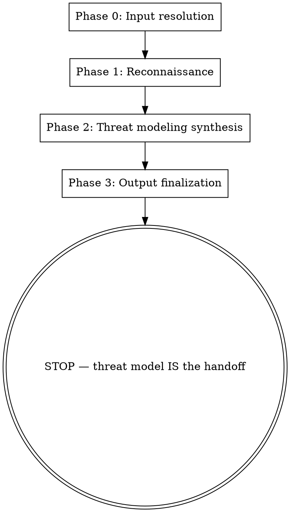

# TMA — Threat Model Analysis

You are producing a Threat Model Analysis for a system: a single canonical document combining system overview, architecture/data flows with trust boundaries, threat actors, STRIDE-per-element analysis, mitigation map, and prioritized findings. You run in four phases: input resolution → parallel reconnaissance → single-context threat-modeling synthesis → output finalization. The terminal state is a written threat model document; you do NOT auto-invoke any other skill after completing.

This tool is the security family's **threat-modeling tool**. It produces the threat model that CSR (critical-security-review) consumes as input when reviewing code post-SDD. TMA is distinct from CSR (code-level vulnerability hunt) and from `arch-review` (general architectural review). The security-trigger list (Appendix C) provides the same trigger taxonomy that CDR's gating question uses; TMA is explicitly user-invoked when those triggers fire or for legacy assessment, pre-production/first-deploy review, or refresh after major arch change.

## Checklist

At invocation, create a todo checklist with one item per phase plus setup:

- [ ] Setup: resolve inputs, determine output location
- [ ] Phase 0: Input resolution
- [ ] Phase 1: Reconnaissance (parallel general-purpose subagents)
- [ ] Phase 2: Threat modeling synthesis (single context)
- [ ] Phase 3: Output finalization

## Process flow

## Input contract

Parse args and auto-classify each input:

- **HTTPS URL** (matches `https://github.com/.../` or similar) → clone with `gh repo clone <url> <tmpdir>` (preferred; uses gh auth) or fallback to `git clone --depth 1 <url> <tmpdir>`. Treat as code.
- **Existing directory path** → treat as code (path used as-is, no clone)
- **Existing file path** → treat as spec/design doc

Extract optional focus hints from prose args (e.g., "focus on the new tenant model", "skip the database layer").

Prompt user for output location if not declared in the args. Sensible default: `<first-code-input-repo-root>/docs/security/tma.md`. User can override.

If no input given, ask the user to provide inputs (paths/URLs/specs).

## Out of scope

For general architectural review (not security-focused — scaling, modularity, technical debt, migration risk, onboarding), use `arch-review` instead.

For code-level vulnerability hunting, authn/authz audit, and dependency CVE checks, use `critical-security-review` after TMA completes. Do NOT auto-invoke CSR — the user decides what's next.

## Threat-modeler mindset

Your job is to map the system's actual threats — NOT to hunt for code-level CVEs, NOT to score architectural quality, NOT to enumerate best practices. The discipline emerges from the STRIDE structure and the bounded output sections below, not from playing a role. You are not a Senior Penetration Tester. You are not paid by the finding. An empty findings section is valid when the system has few real threats.

## Ruthless YAGNI for threat modelers

Do NOT surface:

- **Out-of-scope threat actors** — e.g., nation-state for a personal blog
- **CVE findings** — those are `critical-security-review`'s job
- **Generic architecture concerns not security-related** — those are `arch-review`'s job
- **Threats without a real attack path** — speculation is not a threat
- **Best-practice-as-correctness** — "should add MFA everywhere" is not a threat unless the system's stated security goal explicitly requires MFA in a way the design doesn't satisfy
- **FYI findings** — there is no FYI section; drop or attach to a real threat
- **Quota-driven threats** — the number of real threats is whatever the system actually has, often few

## The four phases

### Phase 0 — Input resolution

- Parse args; auto-classify each input per the Input contract above
- HTTPS URL → clone with `gh repo clone <url> <tmpdir>` (preferred; uses gh auth) or fallback to `git clone --depth 1 <url> <tmpdir>`. Treat as code.
- Existing directory path → treat as code (path used as-is, no clone)
- Existing file path → treat as spec/design doc
- Extract optional focus hints from prose args (e.g., "focus on the new tenant model", "skip the database layer")
- Prompt user for output location if not declared in the args. Sensible default: `<first-code-input-repo-root>/docs/security/tma.md`. User can override.
- Initialize the output file with a placeholder Header section (refresh state finalized in Phase 3)

### Phase 1 — Reconnaissance (parallel)

For each code input (URL-cloned or existing directory), dispatch **one `general-purpose` subagent** with this prompt template (filled in per input):

> You are performing security reconnaissance on a codebase at `{path}`. Your job is to map the codebase's security-relevant surface — NOT to hunt for vulnerabilities (that's a separate tool's job).
>
> Map and report:
> 1. Entry points (HTTP routes, CLI args, message handlers, file parsers, WebSocket endpoints, scheduled jobs)
> 2. Authentication and authorization mechanisms — middleware, decorators, guards, RBAC/ABAC model
> 3. Data stores and how queries are constructed (parameterization, ORM patterns)
> 4. Secrets / keys / tokens — storage, rotation, transmission
> 5. External service integrations and trust assumptions
> 6. Serialization/deserialization boundaries
> 7. File system operations and path construction
> 8. Cryptographic usage
> 9. Dependency manifests (package.json, requirements.txt, go.mod, etc.)
> 10. Sensitive data flows (PII, credentials, payment, PHI) — what data, where it moves
>
> Output a structured recon report (Markdown) with sections: Architecture, Sensitive Data Flows, Trust Boundaries, Attack Surface Table. List file paths for everything referenced. Be thorough but concise.

**Why `general-purpose`, not `Explore`:** Per the Agent tool's documentation, Explore is for narrow lookups ("where is X defined", "find files matching Y") and explicitly excludes "open-ended analysis" — it reads excerpts and will miss content past its read window. TMA Phase 1 IS open-ended analysis spanning multiple cross-cutting aspects of the codebase. `general-purpose` is documented as appropriate for "researching complex questions, searching for code, and executing multi-step tasks."

For **spec inputs**: you (the orchestrator) read them directly (no subagent dispatch). Specs are typically smaller and benefit from integrative reading.

After all subagents complete: integrate subagent reports + spec content → write Sections 2 (System overview) and 3 (Architecture & data flows with trust boundaries) of the output document.

### Phase 2 — Threat modeling synthesis (single context)

Before producing the threat analysis (Section 5) and findings (Section 6), ground threat categorization in **Appendix A: Vulnerability Taxonomy** (below) and score findings consistently using **Appendix B: Severity Classification & SQS** (below).

Do NOT proceed to write Sections 4-7 without consulting these appendices — the threat analysis would be inconsistent across runs without the shared taxonomy/severity grounding.

- Identify threat actors based on the system: external opportunistic, external targeted, insider (privileged user), insider (regular user), compromised supply-chain, automated bots. Per actor: capabilities, motivation, in-scope (yes/no for this system). → write Section 4 (Threat actors)
- For each element from Section 3: enumerate STRIDE threats, list existing mitigations (from recon evidence), list required mitigations (where existing is absent), note residual risk. → write Section 5 (Threat analysis)
- Compile findings into prioritized roadmap. Each finding tagged:
  - **Implemented**: vuln-shaped — this is what's wrong in existing code, fix it
  - **Planned**: constraint-shaped — the design must satisfy this when built
- Severity per **Appendix B**. Prioritization by severity × exploitability × blast-radius. → write Section 6 (Findings)

### Phase 3 — Output finalization

- Write Section 7 (When to refresh) — references the security-trigger list in **Appendix C**. Brief guidance: refresh after major arch change, incident, quarterly check-in.
- Finalize Header section:
  - `Last refreshed: YYYY-MM-DD against commit SHA <X>` for each code input where applicable (`git rev-parse HEAD` per code input)
  - Sources block: list of repo paths/URLs and spec files
  - References block: note that threat categorization and severity follow this skill's built-in taxonomy and rubric (Appendices A–B)
- Show user the output file path
- If clones were created in Phase 0: prompt user keep-or-delete for each cloned directory
- **Stop.** Do NOT auto-invoke CSR or any other skill. The user decides what's next.

## Output format

The threat model document has 7 sections:

| # | Section | Content |
|---|---|---|
| 1 | **Header** | `Last refreshed: YYYY-MM-DD against commit SHA <X>` per code input. Sources block (input paths/URLs). References block (built-in taxonomy/rubric used — Appendices A–B). |
| 2 | **System overview** | 2-3 sentences on what the system does and why it matters. Anchor for everything that follows. |
| 3 | **Architecture & data flows** | Components and how they interact. Data flows annotated with trust boundaries inline (DFD-style in prose + table). |
| 4 | **Threat actors** | Per actor: capabilities, motivation, in-scope (yes/no for this system). |
| 5 | **Threat analysis (STRIDE-per-element)** | For each element from §3: enumerate Spoofing/Tampering/Repudiation/Info-disclosure/DoS/Elevation threats, plus existing mitigations and residual risk inline. Single integrated section instead of separate STRIDE → Mitigation → Residual sections (avoids duplication). |
| 6 | **Findings — prioritized roadmap** | Each finding tagged **Implemented** (vuln-shaped) or **Planned** (constraint-shaped). Severity per Appendix B. Prioritized by severity × exploitability × blast-radius. |
| 7 | **When to refresh** | Brief guidance: refresh after major arch change, incident, quarterly check-in. References the security-trigger list in Appendix C. |

**Format:** Pure markdown. No YAML frontmatter on the output document. Section headers use `##` / `###`.

**Naming:** User-chosen. Convention suggested but not enforced: `<some-prefix>tma.md` or `threat-model.md`.

**Location:** User-declared at invocation time (e.g., `docs/security/tma.md`). User chooses; TMA writes there. Single canonical document overwritten on regeneration. No numbered rounds — TMA is a refresh artifact, not an iterative review.

## Anti-patterns

- Do NOT include code-level CVE/vuln findings (`critical-security-review`'s job)
- Do NOT include generic architecture concerns not security-related (`arch-review`'s job)
- Do NOT auto-chain to CSR after TMA completes
- Do NOT include threats without a real attack path
- Do NOT include threats from threat actors out of scope (e.g., nation-state for a personal blog)
- Do NOT skip phases
- Do NOT fabricate findings to fill sections
- Do NOT use persona framing ("Senior Penetration Tester" etc.) — discipline from constraints, not role

## Rationalization table

| Thought | Reality |
|---|---|
| "I should run a dependency CVE scan to be thorough" | CVE scanning is `critical-security-review`'s job. Drop. |
| "I should rate the architecture's quality" | `arch-review`'s job. Drop. |
| "Best practice is to add MFA everywhere" | Not a threat. Value claim. Drop unless the system's stated security goal explicitly requires MFA in a way the design doesn't satisfy. |
| "I'll mention this potential concern as an FYI" | No FYI section. Drop or attach to a real threat. |
| "I should find at least N threats to be thorough" | Quota-driven critique. The number of real threats is whatever the system actually has. Often few. |

# Appendix A: Vulnerability Taxonomy

The canonical 10-category classification that grounds Phase 2 threat categorization.

## 1. Injection (OWASP A03)
Trace every untrusted input (HTTP params, headers, JSON/XML/GraphQL bodies, cookies, file uploads,
message queues, database-derived values, environment variables) to every dangerous sink (SQL/NoSQL
queries, OS commands, LDAP, template engines, eval/exec, log formatters, mail headers, regex
engines).

Hunt: SQLi, NoSQLi, command injection, SSTI, XPath injection, LDAP injection, header injection, log
injection, ReDoS, expression language injection.

## 2. Broken Access Control (OWASP A01)
Verify authorization enforcement at **every** entry point — not just the presence of middleware, but
correct application.

Hunt: IDOR, forced browsing, vertical/horizontal privilege escalation, missing function-level
authorization, mass assignment, BOLA/BFLA, tenant isolation bypass, path traversal, insecure direct
object reference via predictable IDs, CORS misconfiguration enabling cross-origin state changes,
SSRF.

## 3. Cryptographic Failures & Data Exposure (OWASP A02)
Hunt: hardcoded secrets (keys, tokens, passwords, certificates, connection strings), weak algorithms
(MD5/SHA-1 for security purposes, ECB mode, hardcoded IVs, < 2048-bit RSA), PII/credentials in
logs/error responses/client-side storage/URL parameters, missing encryption at rest or in transit,
insecure random number generation, timing-safe comparison violations.

## 4. Security Misconfiguration (OWASP A05)
Hunt: debug/verbose modes in production, stack traces in responses, directory listing, default
credentials, exposed sensitive endpoints (.git, .env, /actuator, /graphql playground, /debug, backup
files), overly permissive CORS, missing security headers (CSP, HSTS, X-Frame-Options,
X-Content-Type-Options, Permissions-Policy), permissive firewall/network rules in IaC.

## 5. Vulnerable Components & Supply Chain (OWASP A06)
Hunt: outdated dependencies with known CVEs (inspect manifests, lockfiles, Dockerfiles), missing
integrity checks (no lockfile, no hash pinning), typosquat-susceptible dependencies, overly broad
dependency versions, Dockerfile base images with known vulnerabilities, missing SBOM, unverified
third-party scripts/CDN resources.

## 6. Input Validation & Output Encoding (OWASP A03 overlap)
Hunt: missing allowlist validation, weak denylist approaches, absent/incorrect output encoding per
context (HTML body, HTML attributes, JavaScript, CSS, URL), canonicalization bypass, Unicode
normalization attacks, null byte injection, prototype pollution, parameter pollution.

→ XSS family: reflected, stored, DOM-based, mutation XSS, dangerouslySetInnerHTML / v-html /
[innerHTML] misuse.

## 7. Authentication & Session Management (OWASP A07)
Hunt: weak password policies, missing rate-limiting on auth endpoints, absent MFA, session fixation,
predictable session tokens, JWT vulnerabilities (alg:none, weak signing keys, missing expiry, key
confusion attacks), insecure password reset flows, credential stuffing exposure, token leakage
(Referer headers, logs, URLs).

## 8. Business Logic & State Machine Flaws
Hunt: race conditions (TOCTOU), idempotency bypass, negative quantity/price manipulation, unlimited
resource claims (coupons, trials, credits), payment flow bypass, state transition violations,
order/status manipulation, API parameter tampering that violates business rules, missing concurrent
request protection.

## 9. Error Handling & Information Leakage (related: OWASP A09)
Hunt: stack traces exposing internals, verbose error messages revealing schema/paths/versions,
unhandled exceptions disabling security controls, swallowed exceptions masking failures, different
error responses enabling user enumeration, debug information in production responses.

## 10. Emerging & Modern Threats
Hunt as applicable:
- **Deserialization:** gadget chains, unsafe deserializers (pickle, Java ObjectInputStream, PHP
unserialize)
- **Prototype pollution:** JavaScript object prototype manipulation
- **AI/LLM integration:** prompt injection, training data poisoning, excessive agency, insecure
output handling
- **IaC/Container:** root USER in Dockerfile, public cloud storage buckets, permissive IAM policies,
secrets in build layers, missing network policies
- **API-specific:** broken object-level authorization, unrestricted resource consumption, unsafe API
version coexistence, mass assignment via API, GraphQL introspection/batching/depth attacks
- **WebSocket:** missing origin validation, authentication bypass, injection via frames
- **CI/CD:** secret exposure in logs/artifacts, unpinned actions, script injection in workflows

# Appendix B: Severity Classification & SQS

## Severity Classification

Use CVSSv3.1 as inspiration but calibrate to **application context and exploitability**:

| Severity | Criteria | Examples |
|----------|----------|----------|
| **Critical** | Direct RCE, full auth bypass, mass data compromise, trivial exploitation, no user interaction required | Unauthenticated SQLi → full DB, command injection, hardcoded admin credentials |
| **High** | Significant data leak or privilege escalation, SSRF to internal services, mass account takeover possible, moderate exploitation complexity | Stored XSS in admin panel, IDOR to other users' PII, JWT key confusion |
| **Medium** | Limited scope, requires chaining or specific preconditions, lower likelihood | CSRF on non-critical action, reflected XSS requiring social engineering, information disclosure of internal paths |
| **Low** | Best-practice violation, defense-in-depth improvement, minimal direct impact | Missing security header, verbose error in non-sensitive endpoint, cookie without SameSite |

## Security Quality Score (SQS)

**Calculation (starts at 100):**

| Finding Severity | Deduction per Instance | If Grouped (≥3 similar) |
|-----------------|----------------------|------------------------|
| Critical        | −40                  | −40 (count as one)     |
| High            | −20                  | −20 (count as one)     |
| Medium          | −8                   | −8 (count as one)      |
| Low             | −2                   | −2 (count as one)      |
| Informational   | −1                   | −1 (count as one)      |

**Hard gates (override numeric score → automatic BLOCK):**
- Any unremediated Critical finding
- Any Critical/High CVE with EPSS ≥ 0.2 or listed in CISA KEV
- Hardcoded secrets or leaked credentials in source code

**Interpretation:**
| Score          | Posture                                  |
|----------------|------------------------------------------|
| ≥ 85, no Criticals | Strong — deploy with standard monitoring |
| 70–84          | Acceptable — deploy only with remediation commitment and timeline |
| < 70           | Unacceptable — block deployment, urgent remediation required |

# Appendix C: Security Triggers

These are the categories of design change that warrant running TMA. CDR uses the same list as its security-trigger gating question; TMA's `when to invoke` description references this same list to keep them in sync.

| Trigger | Why TMA matters here |
|---|---|
| New or changed auth/authz model | Architectural; very expensive to fix late |
| New tenant model / isolation boundary | Re-architecture later if missed |
| New external integration (payment, third-party API, untrusted source) | New attack surface |
| Handling new class of sensitive data (PII, PHI, payment, credentials) | Compliance + risk implications |
| New trust boundary (admin vs user, internal vs external, service-to-service) | Boundary changes are high-leverage to threat-model |
| Major architectural change (framework migration, rewrite, service split) | Old threat model invalid; need to redo |
| Compliance-driven work (HIPAA, PCI, SOC2) | Threat model is a deliverable |
